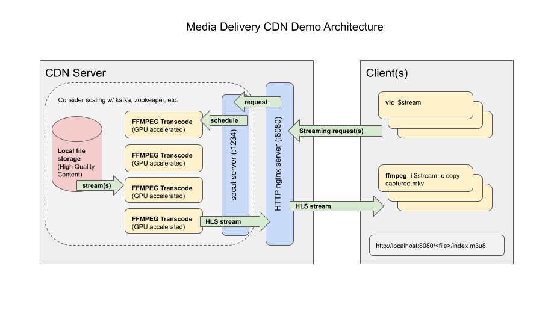

Media Delivery Software Stack
=============================

.. contents::

Overview
--------

This project provides samples to demonstrate the use of Intel GPU in
simplified real-life scenarios involving media streams delivery. It
leverages a Software Stack which consists of the following ingredients:

* `Intel Media SDK <https://github.com/Intel-Media-SDK/MediaSDK>`_
* `Intel Media Driver <https://github.com/intel/media-driver>`_
* `FFmpeg <http://ffmpeg.org/>`_ w/ enabled `ffmpeg-qsv <https://trac.ffmpeg.org/wiki/Hardware/QuickSync>`_
  plugins

Provided samples focus on the key aspects of the proper Intel software
setup and integration with other popular tools you will likely use in
your final product. We try to do our best to provide a configuration which
will demonstrate the best quality and performance for Intel GPU media stack.

Key topics we are covering:

* Samples which demonstrate operations typical for Content Delivery Network (CDN)
  applications such as Video On Demand (VOD) streaming under Nginx server
* Reference command lines (for ffmpeg-qsv and mediasdk native samples) tuned
  for the optimal quality and performance (for the showcasing scenario)
* Quality and Performance measuring infrastructure for data collection
* Intel GPU Performance monitoring

Explore more containers, models and tools on the
`Intel® oneContainer Portal <https://software.intel.com/containers>`_.

Hardware requirements
---------------------

Media Delivery Software Stack requires Gen8+ Intel integrated or discrete GPU.

Active validation is done for the following GPU products:

* Intel® Data Center GPU Flex Series (formerly known as Arctic Sound-M)

Media Delivery Software Stack is supported in maintanence mode for other GPU products.

Build and Setup
---------------

Each sample is available in a form of `Docker <https://docker.com>`_ container
which you need to build locally. Please, use Linux distro for the build and
Docker version 17.05 or later (see `install instructions <https://docs.docker.com/install/>`_).

To build default sample (`CDN`_) targeting Gen8+ legacy upstreamed platforms via stack
self-built from open source projects, run::

  docker build \
    $(env | grep -E '(_proxy=|_PROXY)' | sed 's/^/--build-arg /') \
    --file docker/ubuntu20.04/selfbuild/Dockerfile \
    --tag intel-media-delivery \
    .

Use ``--build-arg SAMPLE=$SAMPLE`` docker build argument to specify other
sample to build.

To build sample targeting DG2/ATS-M stack self-built from open source projects, run::

  docker build \
    $(env | grep -E '(_proxy=|_PROXY)' | sed 's/^/--build-arg /') \
    --file docker/ubuntu20.04/selfbuild-prodkmd/Dockerfile \
    --tag intel-media-delivery \
    .

There are few dockerfiles you can use to build samples. They differ
by origin of the Intel media stack components included into the docker image which implies
which Intel GPUs and media codec features will be supported. Some media stacks might
also require special host setup instruction. See table below.

+----------------------------------------------------+----------------------------------------+------------------------------------------------+--------------------------------------------+
| Dockerfile                                         | Intel media stack origin               | Supported Intel GPUs                           | Host setup instructions                    |
+====================================================+========================================+================================================+============================================+
| `docker/ubuntu20.04/selfbuild/Dockerfile`_         | Self-built from open source            | Gen8+ (legacy upstreamed platforms), such as   | Use any Linux distribution which           |
|                                                    |                                        | SKL, KBL, CFL, TGL, DG1, etc.                  | supports required platform                 |
+----------------------------------------------------+----------------------------------------+------------------------------------------------+--------------------------------------------+
| `docker/ubuntu20.04/selfbuild-prodkmd/Dockerfile`_ | Self-built from open source            | DG2, ATS-M                                     | `Intel GPU DKMS <doc/intel-gpu-dkms.rst>`_ |
+----------------------------------------------------+----------------------------------------+------------------------------------------------+--------------------------------------------+
| `docker/ubuntu20.04/native/Dockerfile`_            | Ubuntu 20.04                           | Gen8+, check Ubuntu 20.04 documentation        | Use any Linux distribution which           |
|                                                    |                                        |                                                | supports required platform                 |
+----------------------------------------------------+----------------------------------------+------------------------------------------------+--------------------------------------------+
| `docker/ubuntu20.04/intel-gfx/Dockerfile`_         | Custom, specified via                  | Depends on the custom stack. Contact supplier.                                              |
|                                                    | ``--build-arg INTEL_GFX_APT_REPO=...`` |                                                                                             |
+----------------------------------------------------+----------------------------------------+------------------------------------------------+--------------------------------------------+

To use some of the examples below you might wish to install the following tools on your
host (or some other system capable of reaching the container over network) to be able
to interact with the service(s) running inside the container:

1. `VLC player <https://www.videolan.org/vlc/index.html>`_ to be able to play streaming
   videos
2. `ffmpeg <http://ffmpeg.org/>`_ to be able to receive and save streaming videos

.. _docker/ubuntu20.04/selfbuild/Dockerfile: docker/ubuntu20.04/selfbuild/Dockerfile
.. _docker/ubuntu20.04/selfbuild-prodkmd/Dockerfile: docker/ubuntu20.04/selfbuild-prodkmd/Dockerfile
.. _docker/ubuntu20.04/native/Dockerfile: docker/ubuntu20.04/native/Dockerfile
.. _docker/ubuntu20.04/intel-gfx/Dockerfile: docker/ubuntu20.04/intel-gfx/Dockerfile

.. _Intel® Iris® Xe MAX Graphics: https://www.intel.com/content/www/us/en/products/discrete-gpus/iris-xe-max.html

Contibuting
-----------

Feedback and contributions are welcome. Please, help improve the project by submitting
issues and pull requests with fixes.

Mind that dockerfiles are being generated from `m4 <https://www.gnu.org/software/m4/>`_
templates via `cmake <https://cmake.org/>`_ build system. Refer to
`generating dockerfiles <doc/docker.rst>`_ document for further details.

How to run?
-----------

Each sample contains few entrypoints:

1. ``demo`` allows to run a demo (mind ``demo help`` and ``man demo``)
2. ``measure`` allows to run a measurement tools (mind ``measure help`` and
   ``man measure``)

To be able to run container successfully you need to start it with certain
permissions allowing access to GPU device(s), file system, etc. The minimal
set of arguments to start a container looks as follows::

  DEVICE=${DEVICE:-/dev/dri/renderD128}
  DEVICE_GRP=$(ls -g $DEVICE | awk '{print $3}' | \
    xargs getent group | awk -F: '{print $3}')
  docker run --rm -it \
    -e DEVICE=$DEVICE --device $DEVICE --group-add $DEVICE_GRP \
    --cap-add SYS_ADMIN \
    -p 8080:8080 \
    intel-media-delivery

Mind that ``-e DEVICE=$DEVICE`` option allows to adjust the host GPU device
to be used under the demo.

Run without entrypoint (as in the example above) to enter shell and look around
inside the container. For example, samples come with the `manual pages <doc/man/readme.rst>`_
which you might review::

  # docker run .... # start container
  # man demo
  # man measure

Please, refer to `Samples HowTo <doc/howto.rst>`_ for the advanced topics like which
host folders you can map and how to do that correctly.

Content Delivery Network (CDN) Samples
--------------------------------------

CDN is about delivering media streams to the clients. As such, samples consist of 2
parts:

1. Service(s) running inside the container which produces and distributes media
   stream(s)
2. Client(s) running somewhere (not necessarily inside the container)
   which consume media streams

To get list of streams you will be able to play, execute::

  DEVICE=${DEVICE:-/dev/dri/renderD128}
  DEVICE_GRP=$(ls -g $DEVICE | awk '{print $3}' | \
    xargs getent group | awk -F: '{print $3}')
  docker run --rm -it \
    -e DEVICE=$DEVICE --device $DEVICE --group-add $DEVICE_GRP \
    --cap-add SYS_ADMIN \
    -p 8080:8080 \
    intel-media-delivery demo streams

On the output you should get list of streams similar to the following::

  http://localhost:8080/vod/avc/WAR_TRAILER_HiQ_10_withAudio/index.m3u8
  http://localhost:8080/vod/hevc/WAR_TRAILER_HiQ_10_withAudio/index.m3u8

These streams can be supplied as an input to the demo command lines
described below. Mind however that HEVC streaming might not be supported by
some client applications, for example, web browsers.

If you want to run a client on some other system rather than host, make sure
to substitute ``localhost`` with the host IP address::

  http://<host-ip>:8080/vod/avc/WAR_TRAILER_HiQ_10_withAudio/index.m3u8

Above example just lists content embedded in the container on the build stage.
See `Content Attribution`_ for the copyright info of the embedded video. See
`Container volumes (adding your content, access logs, etc.) <doc/howto.rst#container-volumes-adding-your-content-access-logs-etc>`_
for how to add your own content to the demo.

You can run samples in different modes depending on where client is
located. These modes comes with slightly different levels of complexity - see
below paragraphs for mode details.

Default demo mode
~~~~~~~~~~~~~~~~~

In a default demo mode client is ran inside the container. As such, you don't need
to interact with the container in any other way rather than to start and stop it.
This is the simplest demo mode. To run it, execute::

  DEVICE=${DEVICE:-/dev/dri/renderD128}
  DEVICE_GRP=$(ls -g $DEVICE | awk '{print $3}' | \
    xargs getent group | awk -F: '{print $3}')
  docker run --rm -it \
    -e DEVICE=$DEVICE --device $DEVICE --group-add $DEVICE_GRP \
    --cap-add SYS_ADMIN \
    -p 8080:8080 \
    intel-media-delivery \
    demo http://localhost:8080/vod/avc/WAR_TRAILER_HiQ_10_withAudio/index.m3u8

Upon successful launch you will see output similar to the below one.

.. image:: doc/pic/demo-ffmpeg.png

Few terminals will be opened in a tiled layout and provide the following information:

1. /top-left/ Client monitoring statistics (how many clients are running and/or stopped, their FPS, etc.)
2. /top-right/ GPU monitoring data (GPU engines utilization)
3. /bottom-right/ Server monitoring statistics (how many requests server received, running FPS, etc.)
4. /bottom-left/ CPU and system monitroing data (CPU and memory utilization, tasks running, etc.)

Tiled terminals are managed by `tmux <https://github.com/tmux/tmux>`_. Please, refer to
its documentation if you wish to navigate and play around with the demo. To
terminate, just press CTRL+C and CTRL+D repeatedly to stop and exit each
script and/or monitoring process.

Interactive demo mode
~~~~~~~~~~~~~~~~~~~~~

With "interactive" demo mode container runs all the services required for streaming, but
awaits for the user interaction to trigger it. To start demo in this mode, execute::

  DEVICE=${DEVICE:-/dev/dri/renderD128}
  DEVICE_GRP=$(ls -g $DEVICE | awk '{print $3}' \
    xargs getent group | awk -F: '{print $3}')
  docker run --rm -it \
    -e DEVICE=$DEVICE --device $DEVICE --group-add $DEVICE_GRP \
    --cap-add SYS_ADMIN \
    -p 8080:8080 \
    intel-media-delivery demo

After that you need to trigger streaming via some client running outside of the
container. For example, from the host::

  vlc http://localhost:8080/vod/avc/WAR_TRAILER_HiQ_10_withAudio/index.m3u8
  # or
  ffmpeg -i http://localhost:8080/vod/avc/WAR_TRAILER_HiQ_10_withAudio/index.m3u8 -c copy WAR_TRAILER_HiQ_10_withAudio.mkv

**Note**: use ``<host-ip>`` instead of ``loсalhost`` starting client on a
system other than host.

Similar to `default demo mode`_ described above, container will start few
terminals, but eventually no client statistics will be available since client
is running elsewhere.
  
Available CDN samples and their architectures
---------------------------------------------

CDN
~~~

This sample can be built with ``--build-arg SAMPLE=cdn`` which is the default.

"CDN" sample uses ffmpeg to generate HLS stream which is better scalable approach
comparing to an alternative to use Nginx `RTMP module <https://github.com/arut/nginx-rtmp-module>`_.
(we provide `Edge`_ sample for this alternative approach). See "CDN" sample architecture
diagram below.

Sample focus on the very basics to configure HLS streaming thru nginx server.
Client requests are served on the same system where nginx server is running
by trivial `socat <http://www.dest-unreach.org/socat/>`_ server which performs
shell script scheduling of background processes to handle transcoding. Increasing
number of parallel client requests (for different streams) would allow to explore
how system behaves under different loads. Mind that you can use ``-<n>`` demo
option to emulate multiple streams available for streaming::

  DEVICE=${DEVICE:-/dev/dri/renderD128}
  DEVICE_GRP=$(ls -g $DEVICE | awk '{print $3}' \
    xargs getent group | awk -F: '{print $3}')
  docker run --rm -it \
    -e DEVICE=$DEVICE --device $DEVICE --group-add $DEVICE_GRP \
    --cap-add SYS_ADMIN \
    -p 8080:8080 \
    intel-media-delivery demo -4 \
      http://localhost:8080/vod/avc/WAR_TRAILER_HiQ_10_withAudio-1/index.m3u8
      http://localhost:8080/vod/avc/WAR_TRAILER_HiQ_10_withAudio-2/index.m3u8
      http://localhost:8080/vod/avc/WAR_TRAILER_HiQ_10_withAudio-3/index.m3u8
      http://localhost:8080/vod/avc/WAR_TRAILER_HiQ_10_withAudio-4/index.m3u8

"CDN" sample can be further scaled. For example, transcoding requests might be served
by the dedicated system where server similar to socat one is running.
Furthermore, each transcoding might be done on the dedicated GPU-capable system
(a node). Typically, such tools like kafka and zookeeper are being used to
manage these many nodes and orchestration server. This sample however intentionally
avoids scaling examples and focuses on streaming configuration basics and key aspects
of GPU accelerated offloads. For the bigger scale CDN sample, please, take a look on
Open Visual Cloud `CDN Transcode Sample <https://github.com/OpenVisualCloud/CDN-Transcode-Sample>`_.

Edge
~~~~

This sample can be built with ``--build-arg SAMPLE=edge``.

"Edge" sample is using Nginx `RTMP module <https://github.com/arut/nginx-rtmp-module>`_
to generate HLS stream. FFmpeg is still used to transcode the stream, but it
does not produce HLS stream. Instead it sends transcoded stream to RTMP
server which actually breaks the stream into fragments and creates HLS
stream. One of the downsides of using RTMP module is that it has limited
codec capabilities. Specifically, as of now H.265 video is not supported.
See "Edge" sample architecture diagram below.

Effectively, commands lines to try Edge sample are similar to CDN sample.
For example::

  DEVICE=${DEVICE:-/dev/dri/renderD128}
  DEVICE_GRP=$(ls -g $DEVICE | awk '{print $3}' \
    xargs getent group | awk -F: '{print $3}')
  docker run --rm -it \
    -e DEVICE=$DEVICE --device $DEVICE --group-add $DEVICE_GRP \
    --cap-add SYS_ADMIN \
    -p 8080:8080 \
    intel-media-delivery demo -4 \
      http://localhost:8080/vod/avc/WAR_TRAILER_HiQ_10_withAudio-1/index.m3u8
      http://localhost:8080/vod/avc/WAR_TRAILER_HiQ_10_withAudio-2/index.m3u8
      http://localhost:8080/vod/avc/WAR_TRAILER_HiQ_10_withAudio-3/index.m3u8
      http://localhost:8080/vod/avc/WAR_TRAILER_HiQ_10_withAudio-4/index.m3u8

How to run measuring tools?
---------------------------

This project comes with `performance <measure/performance/MSPerf.py>`_ and
`quality <measure/quality/measure-quality>`_ measuring tools which implement
measuring methodologies discussed in `performance <doc/performance.rst>`_
and `quality <doc/quality.rst>`_ methodology documents.

Running these tools is as simply as the following examples.

* For encoding quality measurement of some YUV file (currently tool accepts
  only 8-bit I420 YUV input):

::

  measure quality -w 1920 -h 1080 -f 24 InputVideo.yuv

* For encoding quality measurement of some MP4 file:

::

  measure quality InputVideo.mp4

* For performance measurement of transcoding of some raw H.264/AVC file:

::

  measure perf InputVideo.h264

By default measuring tools will encode with H.264/AVC, to change a codec,
use a ``--codec`` option::

  measure quality --codec HEVC -w 1920 -h 1080 -f 24 InputVideo.yuv
  measure perf --codec HEVC InputVideo.h264

For detailed tools usage refer to the manual pages for
`performance <doc/man/measure-perf.asciidoc>`_ and
`quality <doc/man/measure-quality.asciidoc>`_.

Known limitations
~~~~~~~~~~~~~~~~~

* `measure-quality <doc/man/measure-quality.asciidoc>`_ supports only 8-bit
  I420 input YUV streams

* Intel Media SDK samples don't support input streams in container formats
  (i.e. .mp4, .ts, etc.), hence both measure-quality and measure-perf will
  run measurements only with ffmpeg-qsv path for such streams.

Recommended coding options (High-quality and Performance)
---------------------------------------------------------

Intel’s advanced software bitrate controller (dubbed “EncTools”) has been
designed to boost GPU video quality for AVC, HEVC and (comming soon) AV1 using various
compression efficiency technologies and content adaptive quality optimization
tools while at the same time having minimal impact on the coding performance
(speed). EncTools technology includes tools such as adaptive pyramid quantization,
persistence adaptive quantization, low power look ahead, advanced scene change
detection and `more <doc/quality.rst#enctools-and-extbrc>`_.

The recommended random access transcoding ffmpeg-qsv (Intel GPU integration with
ffmpeg) command lines optimized for high quality and performance are given below:

**AVC/H.264**::

  ffmpeg -hwaccel qsv -qsv_device ${DEVICE:-/dev/dri/renderD128} -c:v $inputcodec -an -i $input \
    -frames:v $numframes -c:v h264_qsv -preset $preset -profile:v high -async_depth 1 \
    -b:v $bitrate -maxrate $((2 * $bitrate)) -bitrate_limit 0 -bufsize $((4 * $bitrate)) \
    -rc_init_occupancy $((2 * $bitrate)) -low_power ${LOW_POWER:-true} \
    -look_ahead_depth 8 -extbrc 1 -b_strategy 1 \
    -adaptive_i 1 -adaptive_b 1 -bf 7 -refs 5 -g 256 -strict -1 \
    -vsync passthrough -y $output

**HEVC/H.265**::

  ffmpeg -hwaccel qsv -qsv_device ${DEVICE:-/dev/dri/renderD128} -c:v $inputcodec -an -i $input \
    -frames:v $numframes -c:v hevc_qsv -preset $preset -profile:v main -async_depth 1 \
    -b:v $bitrate -maxrate $((2 * $bitrate)) -bufsize $((4 * $bitrate)) \
    -rc_init_occupancy $((2 * $bitrate)) -low_power ${LOW_POWER:-true} \
    -look_ahead_depth 8 -extbrc 1 -b_strategy 1 \
    -bf 7 -refs 4 -g 256 -idr_interval begin_only -strict -1 \
    -vsync passthrough -y $output

**AV1 (HW-based BRC, EncTools coming soon)**::

  ffmpeg -hwaccel qsv -qsv_device ${DEVICE:-/dev/dri/renderD128} -c:v $inputcodec -an -i $input \
    -frames:v $numframes -c:v av1_qsv -preset $preset -profile:v main -async_depth 1 \
    -b:v $bitrate -maxrate $((2 * $bitrate)) -bufsize $((4 * $bitrate)) \
    -rc_init_occupancy $(($bufsize / 2)) -b_strategy 1 -bf 7 -g 256 \
    -vsync passthrough -y $output

Extra quality boost can be achieved with use of low power look ahead (by setting
“-look_ahead_depth 40” option) at the expense of a slight performance impact (10-20%).

For best single stream performance or low density use case with high resolutions such as
4K, “-async_depth 2” option is recommended (yielding only negligible quality loss 
compared to “-async_depth 1”).

Recommendations for more specific use cases as well as additional information on
developer configurable bitrate controllers and available advanced coding options
are provided in the supplementary `Video Quality document <doc/quality.rst>`_.

For more details on ffmpeg-qsv supported features, see `ffmpeg-qsv capabilites <doc/features/ffmpeg#readme>`_.

For more information on how to engage with Intel GPU encoding, decoding and transcoding
as well as deal with multiple GPUs, please refer to
`ffmpeg-qsv multi-GPU selection document <https://github.com/Intel-Media-SDK/MediaSDK/wiki/FFmpeg-QSV-Multi-GPU-Selection-on-Linux>`_.

The recommended good practices are used throughout this project: in the demo examples
as well as in the quality and performance measuring tools. The following links provide
additional information:

* `Video Quality Command Lines and Measuring Methodology <doc/quality.rst>`_
* `Video Performance Command Linux and Measuring Methodology <doc/performance.rst>`_

Further reading
---------------

* `Manual Pages <doc/man/readme.rst>`_

  * `man demo <doc/man/demo.asciidoc>`_
  * `man measure-perf <doc/man/measure-perf.asciidoc>`_
  * `man measure-quality <doc/man/measure-quality.asciidoc>`_

* Reference command lines & methodologies

  * `performance <doc/performance.rst>`_
  * `quality <doc/quality.rst>`_

* `Generating Dockerfiles <doc/docker.rst>`_
* `HowTo <doc/howto.rst>`_
* `Tests <tests/readme.rst>`_

* `General Purpose GPU Drivers for Linux* Operating Systems <https://intel.com/linux-graphics-drivers>`_
* `Intel Media SDK <https://github.com/Intel-Media-SDK/MediaSDK>`_
* `Intel Media Driver <https://github.com/intel/media-driver>`_

* `Intel Linux Graphics Drivers <https://intel.com/linux-graphics-drivers>`_
* `Open Visual Cloud <https://01.org/openvisualcloud>`_

  * `CDN Transcode Sample <https://github.com/OpenVisualCloud/CDN-Transcode-Sample>`_

* `Intel® oneContainer Portal <https://software.intel.com/containers>`_
* `One Container Templates <https://github.com/intel/oneContainer-Templates>`_

* `Docker <https://docker.com>`_
* `FFmpeg <http://ffmpeg.org/>`_
* `VLC player <https://www.videolan.org/vlc/index.html>`_
* `NGinx <http://nginx.org>`_

Content Attribution
-------------------

Container image comes with some embedded content attributed as follows::

  /opt/data/embedded/WAR_TRAILER_HiQ_10_withAudio.mp4:
    Film: WAR - Courtesy & Copyright: Yash Raj Films Pvt. Ltd.

Inside the container, please, refer to the following file::

  cat /opt/data/embedded/usage.txt
