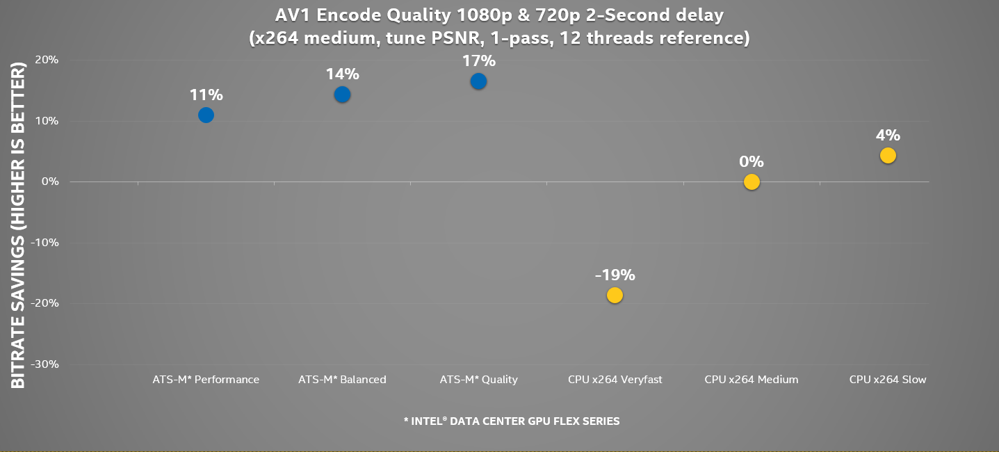

Accelerating Media Delivery with Intel® Data Center GPU Flex Series
===================================================================

.. contents::

Intel's media accelerators featuring Intel® Quick Sync Video transcode 
optimize both throughput and visual quality for video cloud 
distribution. Three classes of accelerator engines target high density 
video decode, encode, and video processing.  These unlock real-time 
customers needing:

* File based, Just-in-time, and Live consumption and creation
* Bandwidth-efficient media delivery for Adaptive bitrate streaming, 
  user generated content upload, and high visual quality broadcast

Intel's discrete graphics accelerators are well integrated into open 
source media frameworks such as FFmpeg and Intel® oneAPI Video Processing
Library. These popular frameworks allow both complex pipeline support
as well as extreme customization of accelerator control. To make these
tools even more accessible to Linux developers we're now providing build
scripts in Docker on the latest Linux kernels.

About Intel® Data Center GPU Flex Series
----------------------------------------

`Intel® Data Center GPU Flex Series <https://ark.intel.com/content/www/us/en/ark/products/series/230021/intel-data-center-gpu-flex-series.html>`_
(products formerly Arctic Sound) comes in two flavors:

* `Intel® Data Center GPU Flex 140 <https://ark.intel.com/content/www/us/en/ark/products/230020/intel-data-center-gpu-flex-140.html>`_
* `Intel® Data Center GPU Flex 170 <https://ark.intel.com/content/www/us/en/ark/products/230019/intel-data-center-gpu-flex-170.html>`_

These accelerators have 4 classes of video accelerator engines:

* 2 engines (VDBOX) accelerate video decode and encode
* 2 video enhancement engines (VEBOX) and two Scale and Format Converters (SFC)
  accelerate video scaling, color space conversion, denoise, deinterlace and more
* 1 render engine provides distributed execution units combined with media samplers
* 1 (or 4 for ATS-M150) compute engines allows parallel access to distributed
  execution units to accelerate AI and intensive compute workloads

The combination of 4 accelerator types ensures typical transcode operations
can pipeline execution to minimize latency. Multiple accelerator units allow
concurrent execution of multiple frames to maximize throughput.

**Caption:** Picture provides brief overview of Intel® Data Center GPU Flex 140 (ATS-M75) and
Intel® Data Center GPU Flex 170 (ATS-M150) SoC. Other Adapters might have different architecture
and features.

+----------------------------+----------------------------------+------------------------------------+
|                            | Intel® Data Center GPU Flex 140  | Intel® Data Center GPU Flex 170    |
+============================+==================================+====================================+
|                            | .. image:: images/ATS-M75.png    | .. image:: images/ATS-M150.png     |
+----------------------------+----------------------------------+------------------------------------+
| Open Source Reference      | ATS-M75                          | ATS-M150                           |
+----------------------------+----------------------------------+------------------------------------+
| SoC number                 | 2                                | 1                                  |
+----------------------------+----------------------------------+------------------------------------+
| Target Workloads           | Media processing and delivery, Windows and Android cloud gaming,      |
|                            | virtualized desktop infrastructure, AI visual inference               |
+----------------------------+----------------------------------+------------------------------------+
| Card Form Factor           | Half height, half length, single | Full height, three-quarter lenfth, |
|                            | wide, passive cooling            | single wide, passive cooling       |
+----------------------------+----------------------------------+------------------------------------+
| Card TDP                   | 75 watts                         | 150 watts                          |
+----------------------------+----------------------------------+------------------------------------+
| GPUs per Card              | 2                                | 1                                  |
+----------------------------+----------------------------------+------------------------------------+
| GPU Microarchitecture      | Xe-HPG                                                                |
+----------------------------+----------------------------------+------------------------------------+
| Xe Cores                   | 16 (8 per GPU)                   | 32                                 |
+----------------------------+----------------------------------+------------------------------------+
| Fixed Function Media       | 4 (2 per GPU)                    | 2                                  |
+----------------------------+----------------------------------+------------------------------------+
| Ray Tracing                | Yes                                                                   |
+----------------------------+----------------------------------+------------------------------------+
| Peak Compute (Systolic)    | 8 TFLOPS (FP32)/105 TOPS (INT8)  | 16 TFLOPS (FP32)/250 TOPS (INT8)   |
+----------------------------+----------------------------------+------------------------------------+
| Memory Type                | GDDR6                                                                 |
+----------------------------+----------------------------------+------------------------------------+
| Memory Capacity            | 12 GB (6 per GPU)                | 16 GB                              |
+----------------------------+----------------------------------+------------------------------------+
| Virtualization (Instances) | SR-IOV (62)                      | SR-IOV (31)                        |
+----------------------------+----------------------------------+------------------------------------+
| Host Bus                   | PCIe Gen 4                                                            |
+----------------------------+----------------------------------+------------------------------------+
| Host CPU Support           | 3rd Generation Intel® Xeon® Scalable Processors                       |
+----------------------------+----------------------------------+------------------------------------+

For more details refer to the following materials:

* `Intel® Data Center GPU Flex Series - Overview <https://www.intel.com/content/www/us/en/products/docs/discrete-gpus/data-center-gpu/flex-series/overview.html>`_
* `Intel® Data Center GPU Flex Series - Product Brief <https://www.intel.com/content/www/us/en/products/docs/discrete-gpus/data-center-gpu/flex-series/product-brief.html>`_
* `Intel® Data Center GPU Flex Series - Media Processing & Delivery Solution Brief <https://www.intel.com/content/www/us/en/products/docs/discrete-gpus/data-center-gpu/flex-series/media-delivery-solution-brief.html>`_

Media Capabilities
------------------

Intel® Data Center GPU Flex Series comes with the following exciting new features for media:

* AV1 Hardware Encoding support
* Advanced software bitrate controller to boost hardware encoding quality

Below we give brief overview of Intel® Data Center GPU Flex Series
Graphics Adapter’s Media capabilities. Other Adapters might have
different features. You can find more information about
supported media features in media-driver
`documentation <https://github.com/intel/media-driver/blob/master/README.md#components-and-features>`_.

+----------------+---------------+---------------+
| Fixed Function | ATS-M75       | ATS-M150      |
+================+===============+===============+
| VEBOX          | 4 (2 per SoC) | 2 (2 per SoC) |
+----------------+---------------+---------------+
| VDBOX          | 4 (2 per SoC) | 2 (2 per SoC) |
+----------------+---------------+---------------+
| SFC            | 4 (2 per SoC) | 2 (2 per SoC) |
+----------------+---------------+---------------+
| VME            | 0             | 0             |
+----------------+---------------+---------------+

Fixed Function Encode (VDENC)
~~~~~~~~~~~~~~~~~~~~~~~~~~~~~

+-------+----------------+-------+-------------+----------------+
| Codec | Sampling Depth | BPP   | Format      | Max Resolution |
+=======+================+=======+=============+================+
| AVC   | 4:2:0          | 8     | Progressive | 4K             |
+-------+----------------+-------+-------------+----------------+
| HEVC  | 4:2:0          | 8, 10 | Progressive | 8K             |
+-------+----------------+-------+-------------+----------------+
| HEVC  | 4:4:4          | 8, 10 | Progressive | 5K             |
+-------+----------------+-------+-------------+----------------+
| VP9   | 4:2:0          | 8, 10 | Progressive | 8K             |
+-------+----------------+-------+-------------+----------------+
| VP9   | 4:4:4          | 8, 10 | Progressive | 5K             |
+-------+----------------+-------+-------------+----------------+
| AV1   | 4:2:0          | 8, 10 | Progressive | 8K             |
+-------+----------------+-------+-------------+----------------+
| JPEG  | 4:2:0          | 8     | Progressive |                |
+-------+----------------+-------+-------------+----------------+
| JPEG  | 4:2:2          | 8     | Progressive |                |
+-------+----------------+-------+-------------+----------------+
| JPEG  | 4:4:4          | 8     | Progressive |                |
+-------+----------------+-------+-------------+----------------+

Fixed Function Decode
~~~~~~~~~~~~~~~~~~~~~

+-------+----------------+-----------+-------------------------+----------------+
| Codec | Sampling Depth | BPP       | Format                  | Max Resolution |
+=======+================+===========+=========================+================+
| MPEG2 | 4:2:0          | 8         | Progressive, Interlaced | FHD            |
+-------+----------------+-----------+-------------------------+----------------+
| AVC   | 4:2:0          | 8         | Progressive, Interlaced | 4K             |
+-------+----------------+-----------+-------------------------+----------------+
| HEVC  | 4:2:0          | 8, 10, 12 | Progressive             | 8K             |
+-------+----------------+-----------+-------------------------+----------------+
| HEVC  | 4:2:2          | 8, 10, 12 | Progressive             | 8K             |
+-------+----------------+-----------+-------------------------+----------------+
| HEVC  | 4:4:4          | 8, 10, 12 | Progressive             | 5K             |
+-------+----------------+-----------+-------------------------+----------------+
| VP9   | 4:2:0          | 8, 10, 12 | Progressive             | 8K             |
+-------+----------------+-----------+-------------------------+----------------+
| VP9   | 4:4:4          | 8, 10, 12 | Progressive             | 5K             |
+-------+----------------+-----------+-------------------------+----------------+
| AV1   | 4:2:0          | 8, 10     | Progressive             | 8K             |
+-------+----------------+-----------+-------------------------+----------------+
| JPEG  | 4:2:0          | 8         | Progressive             |                |
+-------+----------------+-----------+-------------------------+----------------+
| JPEG  | 4:2:2          | 8         | Progressive             |                |
+-------+----------------+-----------+-------------------------+----------------+
| JPEG  | 4:4:4          | 8         | Progressive             |                |
+-------+----------------+-----------+-------------------------+----------------+

Performance
-----------

Each Intel® Data Center GPU Flex Series graphics die achieves the highest
levels of performance for the modern generation video standards like HEVC
and AV1, while still supporting ultra-high density and high quality transcode.

When using high level API’s like FFMPEG, we provide three convenient operating
presets that offer different tradeoffs between speed and quality (many
additional controls are available for developers use). For more details
check `Video Performance Command Linux and Measuring Methodology <../../performance.rst>`_.

See key platform capabilities highlight below:

========================================= =========================================
.. image:: images/HEVC-HEVC_Transcode.png .. image:: images/AV1-AV1_Transcode.png

========================================= =========================================

We evaluate performance on the following streams:

* https://repositories.intel.com/media/bbb_sunflower_1080p_60fps_4Mbps_38kframes.h264
* https://repositories.intel.com/media/bbb_sunflower_1080p_60fps_4Mbps_38kframes.h265
* https://repositories.intel.com/media/bbb_sunflower_1080p_60fps_4Mbps_38kframes_av1.ivf
* https://repositories.intel.com/media/bbb_sunflower_2160p_60fps_8Mbps_38kframes.h264
* https://repositories.intel.com/media/bbb_sunflower_2160p_60fps_8Mbps_38kframes.h265
* https://repositories.intel.com/media/bbb_sunflower_2160p_60fps_8Mbps_38kframes_av1.ivf

See the following files for attributions:

* https://repositories.intel.com/media/license_bbb.txt

To verify downloads, use:

* https://repositories.intel.com/media/md5_checksum.txt

Quality
-------

Intel® Data Center GPU Flex Series offers significant HEVC and AVC encode improvements
over the previous generation of hardware encoders. When compared to typical
presets on popular software video encoders (x264* and x265*) Intel® Data Center
GPU Flex Series provides acceleration at similar quality level. AV1 encoding
offers bandwidth and bitrate savings if 30% over AVC in Low Delay.

AV1 Bandwidth or bitrate savings of 30% over AVC in low delay encoding

The graphs (below) illustrate the video bitrate savings of Intel® Data Center
GPU Flex Series graphics compared with the most common presets.

Random Access Encoding
~~~~~~~~~~~~~~~~~~~~~~

For more details about testing methodology in case of Random Access encoding, check
`Video Quality Command Lines and Measuring Methodology <../../quality.rst>`_.

**Caption:** These charts illustrate quality savings as a percent of bitrate saved
for 8-bit 420 720p and 1080p compressed video streams. Bitrate savings are computed
as BDRATE (using piecewise linear approach). Each point on the chart is the average
BDRATE computed across 27 standard short sequences generated in both CBR and VBR.
The objective visual quality metric used in the BDRATE calculation is Luma PSNR,
averaged across frames. BDRATE is calculated using baselines of x264 for AVC and AV1
or x265 medium for HEVC.

**Caption:** These charts use the same approach but illustrates the consistent
average bitrate savings of the Intel encoders.

Low Delay Encoding
~~~~~~~~~~~~~~~~~~

For more details about testing methodology in case of Low Delay encoding, check
`Low Delay Video Quality Command Lines and Measuring Methodology <../../quality-lowdelay.rst>`_.

**Caption:** These charts illustrate quality savings as a percent of bitrate saved
for 8-bit 420 720p and 1080p compressed video streams. Bitrate savings are computed
as BDRATE (using piecewise linear approach). Each point on the chart is the average
BDRATE computed across 27 standard short sequences generated in both CBR and VBR.
The objective visual quality metric used in the BDRATE calculation is Luma PSNR,
averaged across frames. BDRATE is calculated using baselines of x264 for AVC and AV1
or x265 medium for HEVC.

**Caption:** This chart uses the same approach but illustrates the consistent
average bitrate savings of the Intel AV1 encoder over (Intel) AVC and software
x264* encoders.

**Caption:** These charts use the same approach but illustrates the consistent
average bitrate savings of the Intel encoders.

Recommended coding options (High-quality and Performance)
---------------------------------------------------------

Bwlow we will provide command line recommendations for ffmpeg transcoding in
Random Access and Low Delay modes.

For more details on ffmpeg-qsv supported features, see `ffmpeg-qsv capabilites <../../features/ffmpeg#readme>`_.

For more information on how to engage with Intel GPU encoding, decoding and transcoding
as well as deal with multiple GPUs, please refer to
`ffmpeg-qsv multi-GPU selection document <https://github.com/Intel-Media-SDK/MediaSDK/wiki/FFmpeg-QSV-Multi-GPU-Selection-on-Linux>`_.

The recommended good practices are used throughout this project: in the demo examples
as well as in the quality and performance measuring tools. The following links provide
additional information:

* `Random Access Video Quality Command Lines and Measuring Methodology <../../quality.rst>`_
* `Low Delay Video Quality Command Lines and Measuring Methodology <../../quality-lowdelay.rst>`_
* `Video Performance Command Linux and Measuring Methodology <../../performance.rst>`_

Random Access Encoding
~~~~~~~~~~~~~~~~~~~~~~

Intel’s advanced software bitrate controller (dubbed “EncTools”) has been
designed to boost GPU video quality for AVC, HEVC and (coming soon) AV1 using various
compression efficiency technologies and content adaptive quality optimization
tools while at the same time having minimal impact on the coding performance
(speed). EncTools technology includes tools such as adaptive pyramid quantization,
persistence adaptive quantization, low power look ahead, advanced scene change
detection and `more <../../quality.rst#enctools-and-extbrc>`_.

The recommended random access transcoding ffmpeg-qsv (Intel GPU integration with
ffmpeg) command lines optimized for high quality and performance are given below:

**AVC/H.264**::

  ffmpeg -hwaccel qsv -qsv_device ${DEVICE:-/dev/dri/renderD128} -c:v $inputcodec -extra_hw_frames 8 -an -i $input \
    -frames:v $numframes -c:v h264_qsv -preset $preset -profile:v high -async_depth 1 \
    -b:v $bitrate -maxrate $((2 * $bitrate)) -bitrate_limit 0 -bufsize $((4 * $bitrate)) \
    -rc_init_occupancy $((2 * $bitrate)) -low_power ${LOW_POWER:-true} \
    -look_ahead_depth 8 -extbrc 1 -b_strategy 1 \
    -adaptive_i 1 -adaptive_b 1 -bf 7 -refs 5 -g 256 -strict -1 \
    -vsync passthrough -y $output

**HEVC/H.265**::

  ffmpeg -hwaccel qsv -qsv_device ${DEVICE:-/dev/dri/renderD128} -c:v $inputcodec -extra_hw_frames 8 -an -i $input \
    -frames:v $numframes -c:v hevc_qsv -preset $preset -profile:v main -async_depth 1 \
    -b:v $bitrate -maxrate $((2 * $bitrate)) -bufsize $((4 * $bitrate)) \
    -rc_init_occupancy $((2 * $bitrate)) -low_power ${LOW_POWER:-true} \
    -look_ahead_depth 8 -extbrc 1 -b_strategy 1 \
    -bf 7 -refs 4 -g 256 -idr_interval begin_only -strict -1 \
    -vsync passthrough -y $output

**AV1 (HW-based BRC, EncTools coming soon)**::

  ffmpeg -hwaccel qsv -qsv_device ${DEVICE:-/dev/dri/renderD128} -c:v $inputcodec -an -i $input \
    -frames:v $numframes -c:v av1_qsv -preset $preset -profile:v main -async_depth 1 \
    -b:v $bitrate -maxrate $((2 * $bitrate)) -bufsize $((4 * $bitrate)) \
    -rc_init_occupancy $(($bufsize / 2)) -b_strategy 1 -bf 7 -g 256 \
    -vsync passthrough -y $output

Extra quality boost can be achieved with use of low power look ahead (by setting
“-look_ahead_depth 40” option) at the expense of a slight performance impact (10-20%).
The use of "-extra_hw_frames" option is currently required for transcoding with look ahead
due to the increased GPU memory requirements. Please set the value for "-extra_hw_frames"
to be the same as the number of lookahead frames.

For best single stream performance on low density use case with high resolutions such as
4K, “-async_depth 2” option is recommended (yielding only negligible quality loss
compared to “-async_depth 1”).

Recommendations for more specific use cases as well as additional information on
developer configurable bitrate controllers and available advanced coding options
is provided in the supplementary `Video Quality document <../../quality.rst>`_.

Low Delay Encoding
~~~~~~~~~~~~~~~~~~

The recommended low delay transcoding ffmpeg-qsv (Intel GPU integration with
ffmpeg) command lines optimized for high quality and performance are given below:

**AVC/H.264**::

  ffmpeg -hwaccel qsv -qsv_device ${DEVICE:-/dev/dri/renderD128} -c:v $inputcodec -an -i $input \
    -frames:v $numframes -c:v h264_qsv -preset $preset -profile:v high -async_depth 1 \
    -b:v $bitrate -maxrate $bitrate -minrate $bitrate -bufsize $((bitrate / 4)) \
    -rc_init_occupancy $((bitrate / 8)) -bitrate_limit 0 \
    -bf 0 -refs 5 -g 9999 -strict 1 -vsync passthrough -y $output

**HEVC/H.265**::

  ffmpeg -hwaccel qsv -qsv_device ${DEVICE:-/dev/dri/renderD128} -c:v $inputcodec -an -i $input \
    -frames:v $numframes -c:v hevc_qsv -preset $preset -profile:v main -async_depth 1 \
    -b:v $bitrate -maxrate $bitrate -minrate $bitrate -bufsize $((bitrate / 4)) \
    -rc_init_occupancy $((bitrate / 8)) \
    -bf 0 -refs 4 -g 9999 -strict 1 -vsync passthrough -y $output

**AV1**::

  ffmpeg -hwaccel qsv -qsv_device ${DEVICE:-/dev/dri/renderD128} -c:v $inputcodec -an -i $input \
    -frames:v $numframes -c:v av1_qsv -preset $preset -profile:v main -async_depth 1 \
    -b:v $bitrate -maxrate $bitrate -minrate $bitrate -bufsize $((bitrate / 2)) -rc_init_occupancy $((bitrate / 4)) \
    -bf 0 -g 9999 -vsync passthrough -y $output

Recommendations for more specific use cases as well as additional information on
developer configurable bitrate controllers and available advanced coding options
is provided in the supplementary `Low Delay Video Quality document <../../quality-lowdelay.rst>`_.

Start Developing
----------------

Intel® Data Center GPU Flex Series uses the same API’s and software
components as Intel’s integrated graphics adapters. Developers and users
can easily access Linux drivers, oneVPL, Intel Media SDK, and FFMPEG. Our
commitment to open source allows developers to easily customize these
components for any video application.

Use FFmpeg `command line <https://ffmpeg.org/ffmpeg.html>`_ tool to
perform basic transcode operations. See `command line examples <../../quality.rst>`_
to achieve optimal quality level for content delivery usage scenarios.
Check out generic `examples <https://trac.ffmpeg.org/wiki/Hardware/QuickSync>`_ for Intel
oneVPL and Media SDK Plugins for FFmpeg.

Start developing or enhance your own application reading
`oneVPL <https://spec.oneapi.io/versions/latest/elements/oneVPL/source/index.html>`_
specification.

Links
-----

* `Intel® Media Delivery Software Stack <https://github.com/intel/media-delivery>`_
* `Intel® Media Driver <https://github.com/intel/media-driver>`_
* `Intel® oneAPI Video Processing Library <https://github.com/oneapi-src/oneVPL>`_
* `Intel® Media SDK <https://github.com/Intel-Media-SDK/MediaSDK>`_
* `Intel® Media SDK Plugins for FFmpeg <https://trac.ffmpeg.org/wiki/Hardware/QuickSync>`_ (also known as
  Intel® Quick Sync Video Plugins for FFmpeg)

Performance collection details
------------------------------

Test by Intel 9/16/2020, Intel® Server System M50CYP2UR208 (products formerly Coyote Pass),
Intel® Xeon® Gold 6336Y Processor @ 2.4GHz, 1 node, 2 sockets, 24 cores/socket, 2 threads/core,
1024GB 32-ch 3200 MT/sec, Intel Turbo Boost enabled, Intel Hyper Threading enabled,
BIOS: 0020P41_CoyotePass_LBG_ICX_UpdateCapsule_prd.bin. Intel® Data Center GPU Flex Series 140,
ATS_M75_128_B0_ES_023_22WW29_03_GS1792_PC9707A_OP1051_ECC_ON_GFX2267.bin,
2 devices per-card, both used to compute performance (stream densitry). N concurrent sessions’
average fps used for performance stream density report. Data collected on PVT card < 65C Temperature.
Ubuntu 20.04 LTS, linux-image-unsigned-5.14.0-1045-oem kernel. Commercial products may operate
at higher or lower frequency.

DG1 reference quality data is measured by Intel 11/20/2020, 11th Gen Intel® Core™ i7-1185G7 (Product
formerly Tiger Lake) @ 3.00GHz, 1 socket, 2 threads/core, 8 total
CPUs, Intel Turbo Boost enabled, Total Memory 7714372kB, BIOS:
TGLSFWI1.R00.3373.A00.2009091720 (ucode: 0x60), Ubuntu 20.04 LTS, gcc
(Ubuntu 9.3.0-10ubuntu2) 9.3.0. For more details see
`Accelerating Media Delivery with Intel® Iris® Xe MAX graphics <../intel-iris-xe-max-graphics/intel-iris-xe-max-graphics.md>`_.

CPU reference quality data is measured by Intel 02/09/2022 on an Intel SawTooth Pass
Server, 1-node, 2-socket, 28 cores/socket, 2 threads/core,
Intel(R) Xeon(R) Platinum 8180 CPU @ 2.50GHz with enabled Intel Hyper Threading,
enabled Intel Turbo Boost, CPU Microcode 0x4D, Windows 10 Enterprise LTSC 64-bit,
240GB 15-ch, DDR4-2666 DRAM.

Multi-stream performance data is collected using scripts noted above 
running file-to-file transcode. The scripts execute multiple concurrent 
720p, 1080p, or 4K content streams, measuring the average frame rate of 
the transcoding process, at increasing numbers of streams to seek a 
target (typically 30 fps or 60 fps). The maximum stream density that
meets or exceeds 98% of the target fps is reported.

The following is a table of the project versions used.

**Project versions**

+-------------------------------------------+-------------------------------------------------------------------------------------------------------------------------------------------------+
| Component                                 | Version                                                                                                                                         |
+===========================================+=================================================================================================================================================+
| I915 DKMS                                 | `UBUNTU2204_22WW34_419_5949_220707.2 <https://github.com/intel-gpu/intel-gpu-i915-backports/releases/tag/UBUNTU2204_22WW34_419_5949_220707.2>`_ |
+-------------------------------------------+-------------------------------------------------------------------------------------------------------------------------------------------------+
| CSE DKMS                                  | `22WW33_419.38_UBUNTU514 <https://github.com/intel-gpu/intel-gpu-cse-backports/releases/tag/22WW33_419.38_UBUNTU514>`_                          |
+-------------------------------------------+-------------------------------------------------------------------------------------------------------------------------------------------------+
| PMT DKMS                                  | `22WW33_419.38_UBUNTU514 <https://github.com/intel-gpu/intel-gpu-pmt-backports/releases/tag/22WW33_419.38_UBUNTU514>`_                          |
+-------------------------------------------+-------------------------------------------------------------------------------------------------------------------------------------------------+
| Intel® Media driver for VAAPI             | `intel-media-22.5.2 <https://github.com/intel/media-driver/releases/tag/intel-media-22.5.2>`_                                                   |
+-------------------------------------------+-------------------------------------------------------------------------------------------------------------------------------------------------+
| Intel® oneAPI Video Processing Library    | `v2022.2.0 <https://github.com/oneapi-src/oneVPL/releases/tag/v2022.2.0>`_                                                                      |
+-------------------------------------------+-------------------------------------------------------------------------------------------------------------------------------------------------+
| Intel® oneVPL GPU Runtime                 | `intel-onevpl-22.5.2 <https://github.com/oneapi-src/oneVPL-intel-gpu/releases/tag/intel-onevpl-22.5.2>`_                                        |
+-------------------------------------------+-------------------------------------------------------------------------------------------------------------------------------------------------+
| Intel® Media SDK                          | `intel-mediasdk-22.5.2 <https://github.com/Intel-Media-SDK/MediaSDK/releases/tag/intel-mediasdk-22.5.2>`_                                       |
+-------------------------------------------+-------------------------------------------------------------------------------------------------------------------------------------------------+
| libva                                     | `2.15.0 <https://github.com/intel/libva/releases/tag/2.15.0>`_                                                                                  |
+-------------------------------------------+-------------------------------------------------------------------------------------------------------------------------------------------------+
| Intel® Graphics Memory Management Library | `intel-gmmlib-22.1.7 <https://github.com/intel/gmmlib/releases/tag/intel-gmmlib-22.1.7>`_                                                       |
+-------------------------------------------+-------------------------------------------------------------------------------------------------------------------------------------------------+
| ffmpeg                                    | `f6a36c7 <https://github.com/FFmpeg/FFmpeg/tree/f6a36c7cf90dc71400c4a1ba0f5c5e8fbbf6d1bf>`_                                                     |
+-------------------------------------------+-------------------------------------------------------------------------------------------------------------------------------------------------+
| ffmpeg-cartwheel                          | `53a3f44 <https://github.com/intel-media-ci/cartwheel-ffmpeg/tree/53a3f442436c471afef579c81965a2f47a675be4>`_                                   |
+-------------------------------------------+-------------------------------------------------------------------------------------------------------------------------------------------------+

Notices & Disclaimers
---------------------

Performance varies by use, configuration and other factors. Learn more
at www.intel.com/PerformanceIndex

Performance results are based on testing as of dates shown in configurations
and may not reflect all publicly available updates. See backup for
configuration details. No product or component can be absolutely secure.

See backup for configuration details. For more complete information about
performance and benchmark results, visit www.intel.com/benchmarks.

Software and workloads used in performance tests may have been optimized
for performance only on Intel microprocessors.

Intel technologies may require enabled hardware, software or service activation.

Your costs and results may vary.

© Intel Corporation. Intel, the Intel logo, and other Intel marks are
trademarks of Intel Corporation or its subsidiaries. Other names and
brands may be claimed as the property of others.

