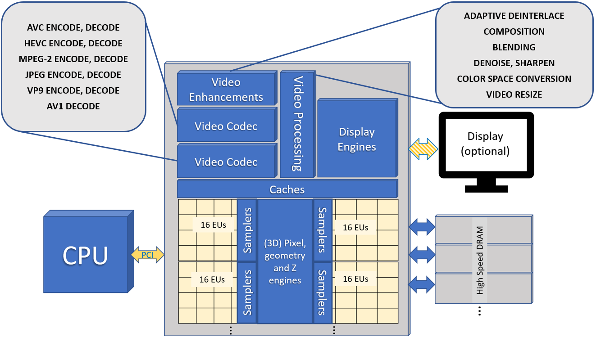
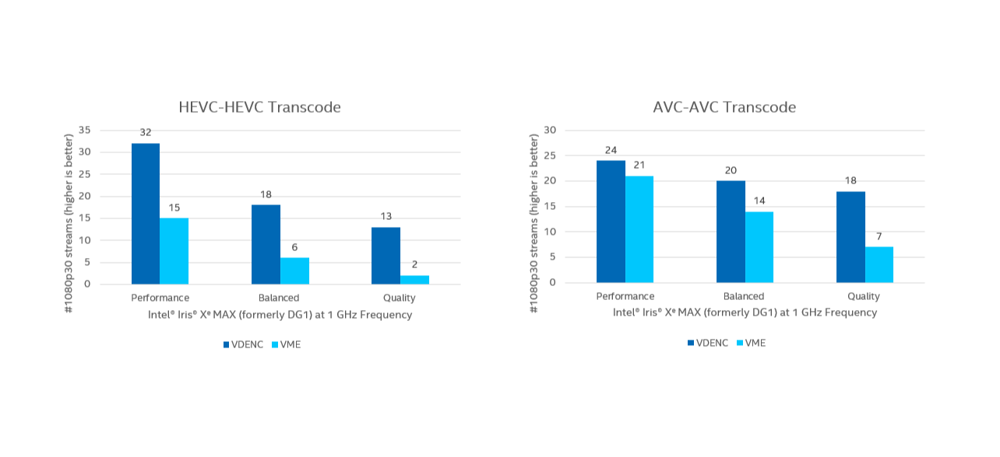
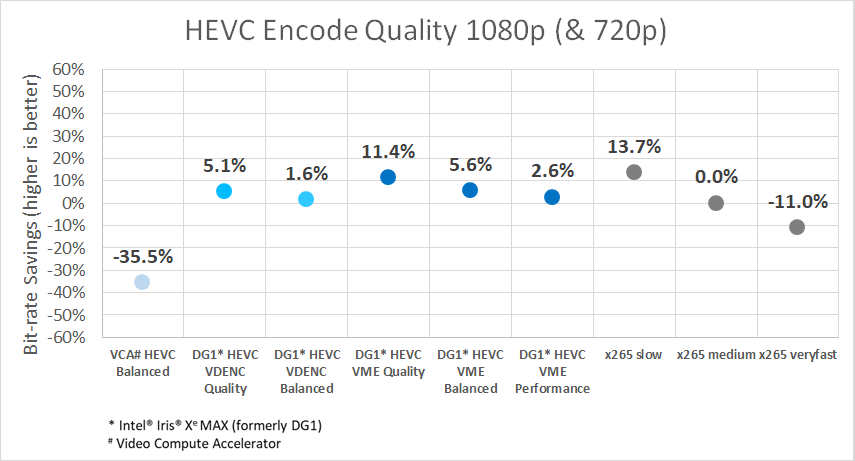
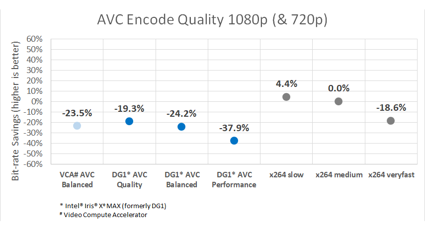
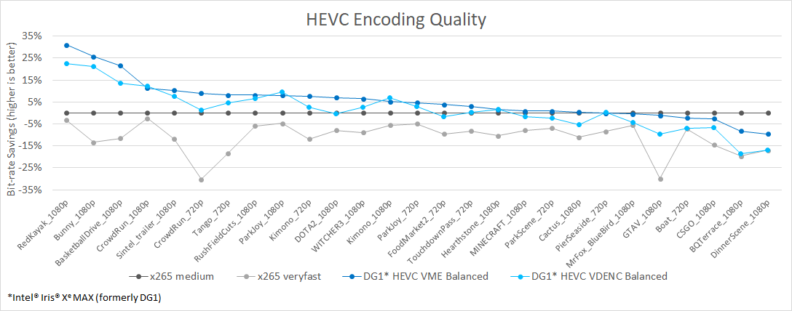
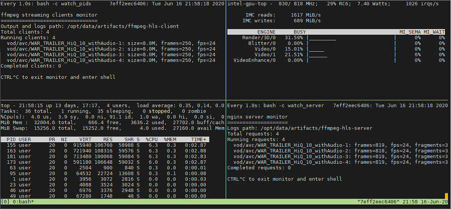
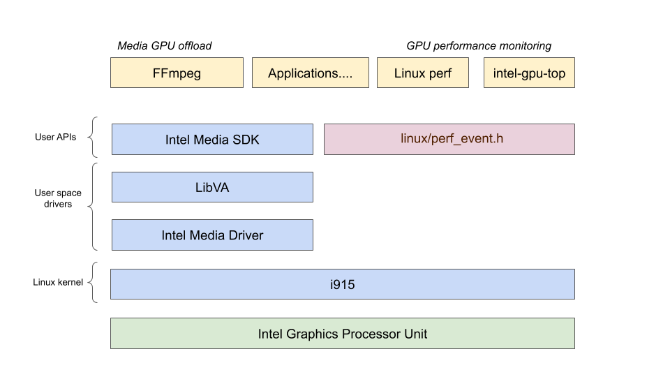

Note: this document was originally posted at https://dgpu-docs.intel.com/devices/iris-xe-max-graphics/guides/media.html.

# Accelerating Media Delivery with Intel® Iris® Xe MAX graphics

Intel's media accelerators featuring Intel® Quick Sync Video transcode 
optimize both throughput and visual quality for video cloud 
distribution. Three classes of accelerator engines target high density 
video decode, encode, and video processing.  These unlock real-time 
customers needing:

* File based, Just-in-time, and Live consumption and creation
* Bandwidth-efficient media delivery for Adaptive bitrate streaming, 
  user generated content upload, and high visual quality broadcast

Intel's discrete graphics accelerators are well integrated into open 
source media frameworks such as FFmpeg and the Intel® Media SDK. These 
popular frameworks allow both complex pipeline support as well as 
extreme customization of accelerator control. To make these tools even 
more accessible to Linux developers we're now providing build scripts in 
Docker on the latest Linux kernels.

# About Intel® Iris® Xe MAX graphics

Intel's integrated graphics products have successfully enabled cloud 
video in products such as Intel Visual Compute Accelerator.
Intel’s new discrete graphics and media accelerators are built upon the 
same media technology used in 11th Gen Intel® Core™ i7-1185G7 (Product 
formerly Tiger Lake).

This accelerator has three classes of video accelerator engine:

* two or more video (codec) engines accelerate video decode, encode, and 
  low-power encode
* one or more video enhancement engine accelerating video resize, color 
  space conversion, denoise, deinterlace and more
* render engine - distributed execution units combined with media 
  samplers



*Caption: Picture provides brief overview of Intel® Iris® Xe MAX 
Graphics Adapter. Other Adapters might have different architecture and 
features. See more information about [supported media 
features](https://github.com/intel/media-driver/blob/master/README.md#components-and-features).*

The combination of three accelerator types ensures typical transcode 
operations can pipeline execution to minimize latency.  Multiple 
accelerator units allow concurrent execution of multiple frames to 
maximize throughput.

## Performance

Each Intel® Iris® Xe MAX graphics die achieves the highest levels of 
performance for the modern generation video standards like HEVC, while 
still supporting ultra-high density and high quality AVC transcode.  
When using high level API's like FFMPEG, we provide three convenient 
operating presets that offer different tradeoffs between speed and 
quality (many additional controls are available for developers use). See 
key platform capabilities highlight below:



## Quality

Intel® Iris® Xe MAX graphics offers significant HEVC encode improvements 
over the previous generation of hardware encoders. When compared to 
typical presets on popular software video encoders (x264* and x265*) 
Intel® Iris® Xe MAX graphics provides acceleration at similar quality.  
The graphs (below) illustrate the video bitrate savings of Intel® Iris® 
Xe MAX graphics compared with the most common presets.

<p align="center">


</p>

*Caption: These charts illustrate quality savings as a percent of 
bitrate saved for 8-bit 420 720p and 1080p compressed video streams. 
Bitrate savings are computed as BDRATE (using piecewise linear 
approach). Each point on the chart is the average BDRATE computed across 
27 standard short sequences generated in both CBR and VBR. The 
objective visual quality metric used in the BDRATE calculation is Luma 
PSNR, averaged across frames. BDRATE is calculated using baselines of 
x264 for AVC or x265 medium for HEVC.*



*Caption: This chart uses the same approach but illustrating the 
consistent average bitrate savings of the Intel HEVC encoders.*

## FFMPEG - Tips for performance

**Disclaimer.** This paragraph provides command line recommendations as they
were originally designed for Intel® Iris® Xe MAX graphics benchmarking and correspond
to [Media Delivery Software Stack v2 Release](https://github.com/intel/media-delivery/releases/tag/v2).
Please, keep in mind that recommendations keep evolving. Refer to the latest
[Media Delivery Software Stack](https://github.com/intel/media-delivery)
sources for the latest recommendations.

FFMPEG is a framework flexible in supporting many video transcode 
pipelines.  To simplify the use our 
[dockerfiles](https://github.com/intel/media-delivery) make it easy to 
build FFMPEG and its dependencies for your Linux platform.  The FFMPEG 
command lines below illustrate good practices in using Intel® Quick Sync 
Video.  The use of "extbrc" demonstrates the use of developer 
configurable bitrate control, in these examples the defaults generate 
streams using pyramid coding and other quality optimizations.

**Example 1: AVC VBR Encode**

```sh
ffmpeg -f rawvideo -pix_fmt yuv420p -s:v ${width}x${height} -r $framerate \
  -i $input -vframes $nframes -y \
  -c:v h264_qsv -preset medium -profile:v high \
  -b:v $bitrate -maxrate $(bitrate*2) -bitrate_limit 0 \
  -bufsize $(bitrate*4) -g 256 -extbrc 1 -b_strategy 1 -bf 7 -refs 5 \
  -vsync 0 $output
```

**Example 2: AVC CBR Encode**

```sh
ffmpeg -f rawvideo -pix_fmt yuv420p -s:v ${width}x${height} -r $framerate \
  -i $input -vframes $nframes -y \
  -c:v h264_qsv -preset medium -profile:v high \
  -b:v $bitrate -maxrate $bitrate -minrate $bitrate -bitrate_limit 0 \
  -bufsize $(bitrate*2) -g 256 -extbrc 1 -b_strategy 1 -bf 7 -refs 5 \
  -vsync 0 $output
```

**Example 3: HEVC VBR Encode**

```sh
ffmpeg -f rawvideo -pix_fmt yuv420p -s:v ${width}x${height} -r $framerate \
  -i $input -vframes $nframes -y \
  -c:v hevc_qsv -preset medium -profile:v main \
  -b:v $bitrate -maxrate $(bitrate*2) -bitrate_limit 0 \
  -bufsize $(bitrate*4) -g 256 -extbrc 1 -refs 5 -bf 7 \
  -vsync 0 $output
```

**Example 4: HEVC CBR Encode**

```sh
ffmpeg -f rawvideo -pix_fmt yuv420p -s:v ${width}x${height} -r $framerate \ 
  -i $input -vframes $nframes -y \
  -c:v hevc_qsv -preset medium -profile:v main \
  -b:v $bitrate -maxrate $bitrate -minrate $bitrate -bitrate_limit 0 \
  -bufsize $(bitrate*2) -g 256 -extbrc 1 -refs 5 -bf 7 \
  -vsync 0 $output
```

## Try it out

See Intel® Iris® Xe MAX graphics running a simple content delivery 
network (CDN) leveraging high density and high performance transcoding. 
Explore our quality and performance measurement infrastructure to level 
set quality and performance expectations from our solution.

See more details and get source code at 
[https://github.com/intel/media-delivery](https://github.com/intel/media-delivery).



*Caption: screen shot from the CDN demo showing \[top left\] client 
status, \[top right\] server video engine performance telemetry, 
\[bottom left\] server CPU utilization, and \[bottom right\] server 
status.*


***Detecting and selecting your Intel® Iris® Xe MAX graphics device:***
  
Each Intel® Iris® Xe MAX SOC is exposed as a unique driver instance in a 
typical Linux guest OS configuration.  Your platform may also contain 
other devices, for example integrated graphics. To launch one or more 
instances of our sample on different devices you will need to supply a 
different parameter to each application instance in the sample above, 
replace e.g. `/dev/dri/renderD128` with the device you want to target. 
More information on mapping the Linux Device instance to the underlying 
hardware type may be found at 
[https://dgpu-docs.intel.com/releases/index.html](https://dgpu-docs.intel.com/releases/index.html)

***Prerequisites:***

* System with Gen9-11 or Xe-LP graphics (Intel® Iris® Xe MAX graphics 
  recommended for best performance)
* Ubuntu 20.04 (w/ the Linux kernel supporting underlying Intel GPU, see 
  [https://dgpu-docs.intel.com/releases/index.html](https://dgpu-docs.intel.com/releases/index.html))
* Client system to receive streaming video (can run on same system as 
  server)

We would like to thank Yash Raj Films for the courtesy of offering their 
trailer "WAR" (Copyright: Yash Raj Films Pvt. Ltd) for use in our demo.

```sh
git clone https://github.com/intel/media-delivery && cd media-delivery
docker build \
  $(env | grep -E '(_proxy=|_PROXY)' | sed 's/^/--build-arg /') \
  --file Dockerfile.ubuntu \
  --tag intel-media-delivery \
  .
DEVICE=${DEVICE:-/dev/dri/renderD128}
DEVICE_GRP=$(stat --format %g $DEVICE)
docker run --rm -it \
  -e DEVICE=$DEVICE --device $DEVICE --group-add $DEVICE_GRP \
  --cap-add SYS_ADMIN \
  -p 8080:8080 \
  intel-media-delivery \
  demo http://localhost:8080/vod/avc/WAR_TRAILER_HiQ_10_withAudio/index.m3u8
```

Try high quality tuned [command 
lines](https://github.com/intel/media-delivery/blob/master/doc/quality.rst) 
for HEVC and AVC video encoding:

```sh
# Film: WAR – Courtesy & Copyright: Yash Raj Films Pvt. Ltd.
wget https://repositories.intel.com/media/WAR_TRAILER_HiQ_10_withAudio.mp4
ffmpeg -an -c:v h264_qsv -i WAR_TRAILER_HiQ_10_withAudio.mp4 \
  -c:v hevc_qsv -preset medium -profile:v main -b:v 2000000 \
  -extbrc 1 -bf 7 -refs 5 \
  vsync 0 -y WAR_2Mbps_VBR_QSV.h265
```

## Start Developing

Intel® Iris® Xe MAX graphics uses exactly the same API's and software 
components as Intel's integrated graphics adapters.  Developers and 
users can easily access Linux drivers, Intel Media SDK, and FFMPEG. Our 
commitment to open source allows developers to easily customize these 
components for any video application.



Use FFmpeg [command line](https://ffmpeg.org/ffmpeg.html) tool to 
perform basic transcode operations. See [command line 
examples](https://github.com/intel/media-delivery/blob/master/doc/quality.rst) 
to achieve optimal quality level for content delivery usage scenarios.
Check out generic 
[examples](https://trac.ffmpeg.org/wiki/Hardware/QuickSync) for Intel 
Media SDK Plugins for FFmpeg.

Start developing or enhance your own application reading [Intel Media 
SDK 
Manual](https://github.com/Intel-Media-SDK/MediaSDK/blob/master/doc/mediasdk-man.md). 
See [command line 
examples](https://github.com/intel/media-delivery/blob/master/doc/quality.rst) 
for Media SDK samples to achieve optimal quality level for content 
delivery usage scenarios.

## Links

* [Intel® Media Delivery Software 
  Stack](https://github.com/intel/media-delivery)
* [Intel® Media Driver](https://github.com/intel/media-driver)
* [Intel® Media SDK](https://github.com/Intel-Media-SDK/MediaSDK)
* [Intel® Media SDK Plugins for 
  FFmpeg](https://trac.ffmpeg.org/wiki/Hardware/QuickSync) (also known as 
  Intel® Quick Sync Video Plugins for FFmpeg)

# Performance collection details

***Configuration notes:***

Test by Intel as of 11/20/2020, 11th Gen Intel® Core™ i7-1185G7 (Product 
formerly Tiger Lake) @ 3.00GHz, 1 Socket, 2 threads per core, 8 total 
CPUs, Intel Turbo Boost enabled, Total Memory 7714372kB, BIOS: 
TGLSFWI1.R00.3373.A00.2009091720 (ucode: 0x60), Ubuntu 20.04 LTS, gcc 
(Ubuntu 9.3.0-10ubuntu2) 9.3.0. Performance data is collected on 
production Intel® Iris® Xe MAX graphics adapter formerly DG1 (PCI ID 
0x4905), EU total 96. Intel® Iris® Xe MAX graphics performance data is 
obtained with GPU operating at a fixed 1.0 GHz with 16 GB onboard 
memory. Commercial products may operate at higher or lower frequency.

Multi-stream performance data is collected using scripts noted above 
running file-to-file transcode. The scripts execute multiple concurrent 
720p, 1080p, or 4K content streams, measuring the average frame rate of 
the transcoding process, at increasing numbers of streams to seek a 
target (typically 30 fps or 60 fps).  The maximum stream density that 
meets or exceeds 98% of the target fps is reported.

The following is a table of the project versions used (listed Intel 
projects are provided on repositories.intel.com/graphics).

***Project versions***

| Component                                 | Version |
|:------------------------------------------|:--------|
| Intel® Media driver for VAAPI             | 20.4.1  |
| Intel® Media SDK                          | 20.4.1  | 
| libva2                                    | 2.9.1   |
| Intel® Graphics Memory Management Library | 20.3.2  |
| ffmpeg                                    | n4.3    |


## Notices & Disclaimers

Software and workloads used in performance tests may have been optimized 
for performance only on Intel microprocessors.

Performance tests, such as SYSmark and MobileMark, are measured using 
specific computer systems, components, software, operations and 
functions.  Any change to any of those factors may cause the results to 
vary.  You should consult other information and performance tests to 
assist you in fully evaluating your contemplated purchases, including 
the performance of that product when combined with other products.  For 
more complete information visit www.intel.com/benchmarks.

Performance results are based on testing as of dates shown in 
configurations and may not reflect all publicly available updates.  See 
backup for configuration details.  No product or component can be 
absolutely secure.

Your costs and results may vary. 

Software and workloads used in performance tests may have been optimized 
for performance only on Intel graphics adapters.  Performance tests used 
here are measured using specific computer systems, components, software, 
operations, and functions. Any change to any of those factors may cause 
the results to vary.  You should consult other information and 
performance tests to assist you in fully evaluating your contemplated 
purchases including the performance of this product when combined with 
other products.  For more complete information visit 
[https://www.intel.com/performance](https://www.intel.com/performance).

Results have been measured on pre-production and production systems, and 
provided to you for information purposes. Any differences in your system 
hardware, software, or configurations may affect your actual 
performance.

Intel technologies, features, and benefits depend on system 
configuration and may require enabled hardware, software, or service 
activation.  Performance varies depending on system configuration. No 
computer system can be absolutely secure.  Check with your system 
manufacturer retailer or learn more at 
[ark.intel.com](http://ark.intel.com)

Intel and Iris are trademarks of Intel Corporation or its subsidiaries.

© Intel Corporation.  Intel, the Intel logo, and other Intel marks are 
trademarks of Intel Corporation or its subsidiaries.  Other names and 
brands may be claimed as the property of others.

