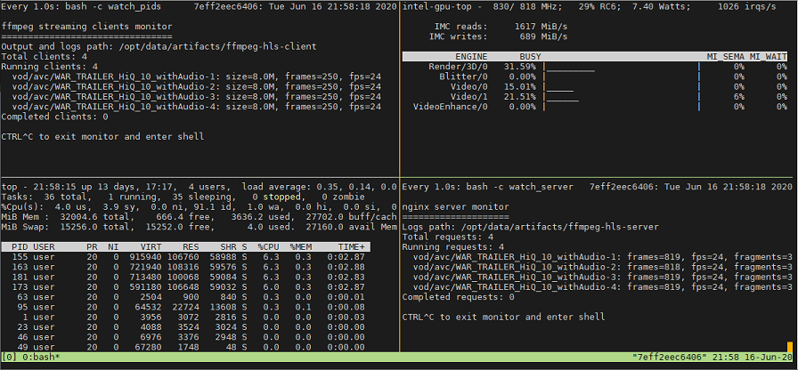

Content Delivery Network (CDN) Demo
===================================

.. contents::

Overview
--------

CDN is about delivering media streams to the clients. As such, samples consist of 2
parts:

1. Service(s) running inside the container which produces and distributes media
   stream(s)
2. Client(s) running somewhere (not necessarily inside the container)
   which consume media streams

We are providing CDN demo samples which are built using `NGinx <http://nginx.org>`_.
For the more complex samples, check out `Open Visual Cloud <https://01.org/openvisualcloud>`_ and
their full scale `CDN Transcode Sample <https://github.com/OpenVisualCloud/CDN-Transcode-Sample>`_.

The following instruction assumes that you've setup a host environment and built
media-delivery container.

To get list of streams you will be able to play, execute::

  DEVICE=${DEVICE:-/dev/dri/renderD128}
  DEVICE_GRP=$(stat --format %g $DEVICE)
  docker run --rm -it \
    -e DEVICE=$DEVICE --device $DEVICE --group-add $DEVICE_GRP \
    --cap-add SYS_ADMIN \
    -p 8080:8080 \
    intel-media-delivery demo streams

On the output should show a list of streams similar to the following::

  http://localhost:8080/vod/avc/WAR_TRAILER_HiQ_10_withAudio/index.m3u8
  http://localhost:8080/vod/hevc/WAR_TRAILER_HiQ_10_withAudio/index.m3u8

These streams can be supplied as an input to the demo command lines
described below. Mind however that HEVC streaming might not be supported by
some client applications, for example, web browsers.

If you want to run a client on some other system rather than the host, make sure
to substitute ``localhost`` with the host IP address::

  http://<host-ip>:8080/vod/avc/WAR_TRAILER_HiQ_10_withAudio/index.m3u8

The above example just lists content embedded in the container on the build stage.
See `Content Attribution <../README.rst#Content Attribution>`_ for the copyright
info of the embedded video. See `Container volumes (adding your content,
access logs, etc.) <howto.rst#container-volumes-adding-your-content-access-logs-etc>`_
for how to add your own content to the demo.

You can run demo in different modes depending on where the client is
located. These modes come with slightly different levels of complexity - see
below paragraphs for mode details.

Default demo mode
~~~~~~~~~~~~~~~~~

In a default demo mode client is ran inside the container. As such, you don't need
to interact with the container in any other way rather than to start and stop it.
This is the simplest demo mode. To run it, execute::

  DEVICE=${DEVICE:-/dev/dri/renderD128}
  DEVICE_GRP=$(stat --format %g $DEVICE)
  docker run --rm -it \
    -e DEVICE=$DEVICE --device $DEVICE --group-add $DEVICE_GRP \
    --cap-add SYS_ADMIN \
    -p 8080:8080 \
    intel-media-delivery \
    demo http://localhost:8080/vod/avc/WAR_TRAILER_HiQ_10_withAudio/index.m3u8

Upon successful launch you will see output similar to the one below.

Few terminals will be opened in a tiled layout and provide the following information:

1. /top-left/ Client monitoring statistics (how many clients are running and/or stopped, their FPS, etc.)
2. /top-right/ GPU monitoring data (GPU engines utilization)
3. /bottom-right/ Server monitoring statistics (how many requests server received, running FPS, etc.)
4. /bottom-left/ CPU and system monitroing data (CPU and memory utilization, tasks running, etc.)

Tiled terminals are managed by `tmux <https://github.com/tmux/tmux>`_. Please, refer to
its documentation if you wish to navigate and play around with the demo. To
terminate, just press CTRL+C and CTRL+D repeatedly to stop and exit each
script and/or monitoring process.

Interactive demo mode
~~~~~~~~~~~~~~~~~~~~~

With "interactive" demo mode container runs all the services required for streaming, but
awaits for the user interaction to trigger it. To start demo in this mode, execute::

  DEVICE=${DEVICE:-/dev/dri/renderD128}
  DEVICE_GRP=$(stat --format %g $DEVICE)
  docker run --rm -it \
    -e DEVICE=$DEVICE --device $DEVICE --group-add $DEVICE_GRP \
    --cap-add SYS_ADMIN \
    -p 8080:8080 \
    intel-media-delivery demo

After that you will need to trigger streaming via some client running outside of the
container. For that purpose you can use `VLC player <https://www.videolan.org/vlc/index.html>`_
or `FFmpeg <http://ffmpeg.org/>`_, Make sure to add exception to your proxy settings
for your host if you are working behind the proxy::

  export no_proxy=localhost

  # trigger transcoding via VLC
  vlc http://localhost:8080/vod/avc/WAR_TRAILER_HiQ_10_withAudio/index.m3u8

  # or ffmpeg:
  ffmpeg -i http://localhost:8080/vod/avc/WAR_TRAILER_HiQ_10_withAudio/index.m3u8 -c copy WAR_TRAILER_HiQ_10_withAudio.mkv

**Note**: use ``<host-ip>`` instead of ``loсalhost`` starting client on a
system other than the host.

Similar to `default demo mode`_ described above, container will start a few
terminals, but eventually no client statistics will be available since the client
is running elsewhere.
  
Available CDN samples and their architectures
---------------------------------------------

CDN
~~~

This sample can be built with ``--build-arg SAMPLE=cdn`` which is the default.

"CDN" sample uses ffmpeg to generate HLS stream which is better scalable approach
comparing to an alternative to use Nginx `RTMP module <https://github.com/arut/nginx-rtmp-module>`_.
See "CDN" sample architecture diagram below.

.. image:: pic/cdn-demo-architecture.png

Sample focus on the very basics to configure HLS streaming thru nginx server.
Client requests are served on the same system where nginx server is running
by trivial `socat <http://www.dest-unreach.org/socat/>`_ server which performs
shell script scheduling of background processes to handle transcoding. Increasing
number of parallel client requests (for different streams) would allow to explore
how system behaves under different loads. Mind that you can use ``-<n>`` demo
option to emulate multiple streams available for streaming::

  DEVICE=${DEVICE:-/dev/dri/renderD128}
  DEVICE_GRP=$(stat --format %g $DEVICE)
  docker run --rm -it \
    -e DEVICE=$DEVICE --device $DEVICE --group-add $DEVICE_GRP \
    --cap-add SYS_ADMIN \
    -p 8080:8080 \
    intel-media-delivery demo -4 \
      http://localhost:8080/vod/avc/WAR_TRAILER_HiQ_10_withAudio-1/index.m3u8
      http://localhost:8080/vod/avc/WAR_TRAILER_HiQ_10_withAudio-2/index.m3u8
      http://localhost:8080/vod/avc/WAR_TRAILER_HiQ_10_withAudio-3/index.m3u8
      http://localhost:8080/vod/avc/WAR_TRAILER_HiQ_10_withAudio-4/index.m3u8

"CDN" sample can be further scaled. For example, transcoding requests might be served
by the dedicated system where server similar to socat one is running.
Furthermore, each transcoding might be done on a dedicated GPU-capable system
(a node). Typically, such tools like kafka and zookeeper are being used to
manage these many nodes and orchestration server. This sample however intentionally
avoids scaling examples and focuses on streaming configuration basics and key aspects
of GPU accelerated offloads. For the bigger scale CDN sample, please, take a look on
Open Visual Cloud `CDN Transcode Sample <https://github.com/OpenVisualCloud/CDN-Transcode-Sample>`_.

