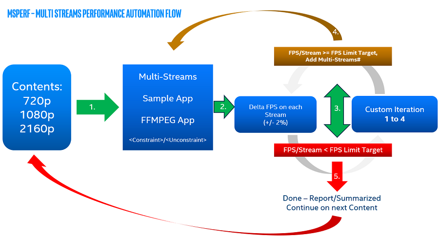
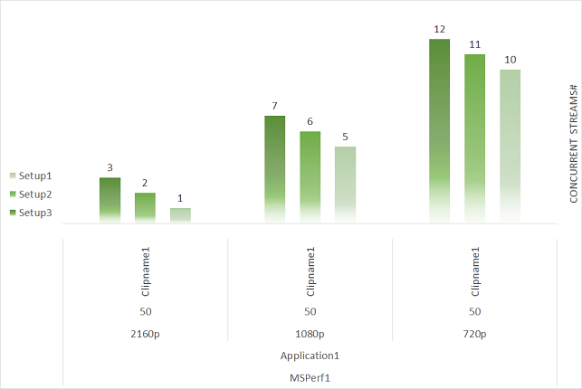
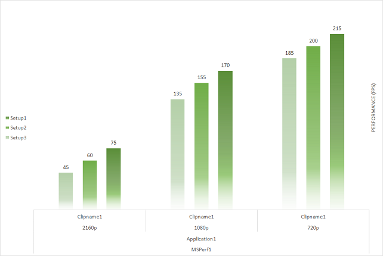
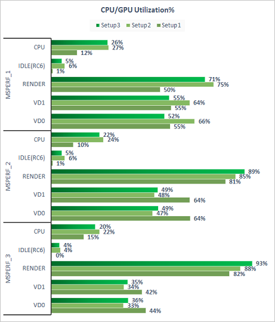
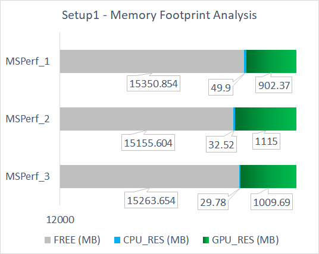

Video Performance
=================

.. contents::

Video Performance Benchmark Data
--------------------------------

* `Benchmark data for Intel® Data Center GPU Flex Series <benchmarks/intel-data-center-gpu-flex-series/intel-data-center-gpu-flex-series.rst>`_
* `Benchmark data for Intel® Iris® Xe MAX graphics <benchmarks/intel-iris-xe-max-graphics/intel-iris-xe-max-graphics.md>`_

Video Performance Assessment Methodology
----------------------------------------

In this document we describe the methodology which is used to measure
performance of Intel® Media SDK `Sample Multi Transcode  <https://github.com/Intel-Media-SDK/MediaSDK/blob/master/doc/samples/readme-multi-transcode_linux.md>`_
and `ffmpeg-qsv <https://trac.ffmpeg.org/wiki/Hardware/QuickSync>`_
(Intel® Media SDK integration into FFmpeg). A `video performance measuring tool <man/measure-perf.asciidoc>`_
which implements this methodology is provided as a part of Media
Delivery Software Stack. In addition, a `quality measuring tool <man/measure-quality.asciidoc>`_ is
provided for allowing users to evaluate video quality (see `quality methodology <quality.rst>`_ documentation).

Key performance metrics we collect are:

* Peak Concurrent Number of Sessions Running in Realtime (Density)
* Peak Frames Per Second (FPS)

There are many other metrics (like CPU and GPU utilization) we
collect to assist in performance investigations and debug:

* Application run time
* CPU-utilization%
* GPU-Utilization%
* Memory footprint and utilization%
* GPU frequency timeline data

With the `measure-perf <man/measure-perf.asciidoc>` tool it is possible to
to enable/disable some metrics collection during the measurement.

We evaluate performance on the following streams:

* https://repositories.intel.com/media/bbb_sunflower_1080p_60fps_4Mbps_38kframes.h264
* https://repositories.intel.com/media/bbb_sunflower_1080p_60fps_4Mbps_38kframes.h265
* https://repositories.intel.com/media/bbb_sunflower_1080p_60fps_4Mbps_38kframes_av1.ivf
* https://repositories.intel.com/media/bbb_sunflower_2160p_60fps_8Mbps_38kframes.h264
* https://repositories.intel.com/media/bbb_sunflower_2160p_60fps_8Mbps_38kframes.h265
* https://repositories.intel.com/media/bbb_sunflower_2160p_60fps_8Mbps_38kframes_av1.ivf

See the following files for attributions:

* https://repositories.intel.com/media/license_bbb.txt

To verify downloads, use:

* https://repositories.intel.com/media/md5_checksum.txt

Multi-Stream Performance
************************

The above picture illustrates multi-stream Performance measurement flow. This is
iterative process where we run predefined command lines (point [1] on the
pic.) and increase number of concurrent sessions (point [3] on the pic.) if
all the sessions can be run at realtime on the current iteration.  "Realtime" 
means we are encoding at the same speed as the output clip's playback framerate.

The goal of the measurement is to obtain data similar to what is shown in
the below chart:

Here we can compare achieved number of cuncurrent sessions (density) for
different resulutions and across different setups.

Single-Stream Performance
*************************

For single-stream performance, we evaluate performance of individual
workloads. The key metric to collect here is transcoding speed in FPS. 
Single-stream performance FPS can sometimes be used to sanity-check multi-stream
density measurements (e.g. a single-stream measurement of 180FPS indicates you 
can expect a density of around 6x 30fps streams running real-time), however care 
must be taken to understand the utilization and concurrency of the video 
engines, video enhancment engine and render engine.  The picture 
below illustrates an example of single-stream performance measurement.

Performance Monitoring and Debug Data
*************************************

There are a number of metrics which are highly useful for performance
monitoring and debug. The below picture gives a good example summary:

These metrics allow users to check whether workload bottleneck is related to CPU
or a particular GPU engine. If this data does not highlight the bottleneck,
but gives a hint of GPU under utilization, the user can look into further details, 
such as memory footprint - see below example.

Eventually all of the above data is useful evaluating and analyzing performance 
for different workload settings and system setups.

Bitrates
--------

Coding bitrates for video performance assessment are selected as a
subset of bitrates used in `quality measuring methodology <quality.rst>`_.
For H.264/AVC we use:

+------------+---------------+-----------------+
| Resolution | Setting       | Bitrates (Mb/s) |
+============+===============+=================+
| 4K         | Low           | 9               |
+------------+---------------+-----------------+
| 1080p      | Low           | 3               |
+------------+---------------+-----------------+
| 720p       | Low           | 1.5             |
+------------+---------------+-----------------+

Coding bitrates for H.265/HEVC video performance assessment:

+------------+---------------+-----------------+
| Resolution | Setting       | Bitrates (Mb/s) |
+============+===============+=================+
| 4K         | Low           | 9               |
+------------+---------------+-----------------+
| 1080p      | Low           | 3               |
+------------+---------------+-----------------+
| 720p       | Low           | 1.5             |
+------------+---------------+-----------------+

Coding bitrates for AV1 video performance assessment:

+------------+---------------+-----------------+
| Resolution | Setting       | Bitrates (Mb/s) |
+============+===============+=================+
| 4K         | Low           | 9               |
+------------+---------------+-----------------+
| 1080p      | Low           | 3               |
+------------+---------------+-----------------+
| 720p       | Low           | 1.5             |
+------------+---------------+-----------------+

EncTools and ExtBRC
-------------------
**EncTools** is Intel’s new software based (SW) BRC which includes a suite of adaptive encoding tools
designed to improve video quality (thus a name EncTools).

**ExtBRC** is Intel’s legacy SW BRC.

EncTools are engaged automatically with enabling external BRC (extbrc 1) and setting lookahead depth >= 1.
Positive lookahead depth will automatically enable EncTools BRC and all adaptive encoding tools. For low
power lookahead to engage with EncTools BRC, lookahead depth should be > mini-GoP size. Several adaptive
encoding tools can be disabled by engaging SMT or FFmpeg-QSV flags, such as, for example, AdaptiveI off
(disable scene cut detection) and AdaptiveB off (disable adaptive mini-GoP). More information on
the individual coding tools of EncTools BRC can be found `here <quality.rst#enctools-and-extbrc>`_.

::

  # triggers EncTools without low power lookahead (performance boost):
  ffmpeg <...> -g 256 -bf 7 -extbrc 1 -look_ahead_depth 8 <...>

  # triggers EncTools with low power lookahead (quality boost):
  ffmpeg <...> -g 256 -bf 7 -extbrc 1 -look_ahead_depth 40 <...>

  # triggers ExtBRC:
  ffmpeg <...> -g 256 -bf 7 -extbrc 1 -look_ahead_depth 0 <...>

Command Lines
-------------

In the following sections you can find command lines used for high quality H.264/AVC, H.265/HEVC and AV1 video
transccoding with Intel® Media SDK `Sample Multi Transcode (SMT) <https://github.com/Intel-Media-SDK/MediaSDK/blob/master/doc/samples/readme-multi-transcode_linux.md>`_
and `ffmpeg-qsv <https://trac.ffmpeg.org/wiki/Hardware/QuickSync>`_ (Intel® Media SDK integration
into FFmpeg) which we use in performance assessments.

H.264/AVC
---------

EncTools
********

To achieve better performance with Intel GPU H.264/AVC encoder running EncTools BRC we recommend the following settings:

+-------------------------------------------------------+----------------+--------------------------------------------------------------------------+
| ffmpeg-qsv options                                    | ffmpeg version | Comments                                                                 |
+=======================================================+================+==========================================================================+
| VBR                                                                                                                                               |
+-------------------------------------------------------+----------------+--------------------------------------------------------------------------+
| ``-b:v $bitrate -maxrate $((2 * $bitrate))``          | n2.8           | maxrate > bitrate triggers VBR. You can vary maxrate per your needs.     |
+-------------------------------------------------------+----------------+--------------------------------------------------------------------------+
| ``-bufsize $((4 * $bitrate))``                        | n4.0           | You can vary bufsize per your needs. We recommend to avoid going below 1 |
|                                                       |                | second to avoid quality loss. Buffer size of 4 seconds is recommended    |
|                                                       |                | for VBR.                                                                 |
+-------------------------------------------------------+----------------+--------------------------------------------------------------------------+
| ``-rc_init_occupancy $((2 * $bitrate))``              | n2.8           | This is the initial buffer delay. You can vary this per your needs.      |
|                                                       |                | Recommendation is to use 1/2 of bufsize.                                 |
+-------------------------------------------------------+----------------+--------------------------------------------------------------------------+
| ``-bitrate_limit 0``                                  | n3.0           | This disables target bitrate limitations that exist in MediaSDK/VPL for  |
|                                                       |                | AVC encoding                                                             |
+-------------------------------------------------------+----------------+--------------------------------------------------------------------------+
| ``-extbrc 1 -look_ahead_depth $lad``                  | n3.0           | This enables EncTools Software BRC when look ahead depth > than 0. Need  |
|                                                       |                | to have look ahead depth > than miniGOP size to enable low power look    |
|                                                       |                | ahead too (miniGOP size is equal to bf+1). The recommended values for    |
|                                                       |                | `$lad` are: 8 (for performance boost) and 40 (for quality boost)         |
+-------------------------------------------------------+----------------+--------------------------------------------------------------------------+
| ``-b_strategy 1 -bf 7``                               | n3.0           | These 2 settings activate full 3 level B-Pyramid.                        |
+-------------------------------------------------------+----------------+--------------------------------------------------------------------------+
| ``-refs 5``                                           | n2.7           | 5 references are important to trigger Long Term Reference (LTR) coding   |
|                                                       |                | feature.                                                                 |
+-------------------------------------------------------+----------------+--------------------------------------------------------------------------+
| ``-g 256``                                            | n2.7           | Select long enough GOP size for random access encoding. You can vary     |
|                                                       |                | this setting. Typically 2 to 4 seconds GOP is used.                      |
+-------------------------------------------------------+----------------+--------------------------------------------------------------------------+
| ``-adaptive_i 1 -adaptive_b 1``                       | n3.0           | Ensures to enable scene change detection and adaptive miniGOP.           |
+-------------------------------------------------------+----------------+--------------------------------------------------------------------------+
| ``-strict -1``                                        | n3.0           | Disables HRD compliance.                                                 |
+-------------------------------------------------------+----------------+--------------------------------------------------------------------------+
| ``-extra_hw_frames $lad``                             | n4.0           | Add extra GPU decoder frame surfaces.  This is currently needed for      |
|                                                       |                | transcoding with look ahead (set this option to look ahead depth value)  |
+-------------------------------------------------------+----------------+--------------------------------------------------------------------------+

::

  # VBR (transcoding with ffmpeg-qsv)
  ffmpeg -hwaccel qsv -qsv_device ${DEVICE:-/dev/dri/renderD128} -c:v $inputcodec -extra_hw_frames $lad -an -i $input \
    -frames:v $numframes -c:v h264_qsv -preset $preset -profile:v high -async_depth $async_depth \
    -b:v $bitrate -maxrate $((2 * $bitrate)) -bitrate_limit 0 -bufsize $((4 * $bitrate)) \
    -rc_init_occupancy $((2 * $bitrate)) -low_power ${LOW_POWER:-true} -look_ahead_depth $lad -extbrc 1 \
    -b_strategy 1 -adaptive_i 1 -adaptive_b 1 -bf 7 -refs 5 -g 256 -strict -1 \
    -fps_mode passthrough -y $output

  # VBR (transcoding from raw bitstream with Sample Multi-Transcode)
  sample_multi_transcode -i::${inputcodec} $input -hw -async $async_depth \
    -device ${DEVICE:-/dev/dri/renderD128} -u $preset -b $bitrateKb -vbr -n $numframes \
    -lowpower:${LOWPOWER:-on} -lad $lad -extbrc::implicit -AdaptiveI:on -AdaptiveB:on -dist 8 -num_ref 5 -gop_size 256 \
    -NalHrdConformance:off -VuiNalHrdParameters:off -hrd $(($bitrateKb / 2)) \
    -InitialDelayInKB $(($bitrateKb / 4)) -MaxKbps $((bitrateKb * 2)) -o::h264 $output

ExtBRC
******

To achieve better performance with Intel GPU H.264/AVC encoder running ExtBRC we recommend the following settings:

+-------------------------------------------------------+----------------+--------------------------------------------------------------------------+
| ffmpeg-qsv options                                    | ffmpeg version | Comments                                                                 |
+=======================================================+================+==========================================================================+
| VBR                                                                                                                                               |
+-------------------------------------------------------+----------------+--------------------------------------------------------------------------+
| ``-b:v $bitrate -maxrate $((2 * $bitrate))``          | n2.8           | maxrate > bitrate triggers VBR. You can vary maxrate per your needs.     |
+-------------------------------------------------------+----------------+--------------------------------------------------------------------------+
| ``-bufsize $((4 * $bitrate))``                        | n4.0           | You can vary bufsize per your needs. We recommend to avoid going below 1 |
|                                                       |                | second to avoid quality loss. Buffer size of 4 seconds is recommended    |
|                                                       |                | for VBR.                                                                 |
+-------------------------------------------------------+----------------+--------------------------------------------------------------------------+
| ``-rc_init_occupancy $((2 * $bitrate))``              | n2.8           | This is the initial buffer delay. You can vary this per your needs.      |
|                                                       |                | Recommendation is to use 1/2 of bufsize.                                 |
+-------------------------------------------------------+----------------+--------------------------------------------------------------------------+
| ``-bitrate_limit 0``                                  | n3.0           | This disables target bitrate limitations that exist in MediaSDK/VPL for  |
|                                                       |                | AVC encoding                                                             |
+-------------------------------------------------------+----------------+--------------------------------------------------------------------------+
| ``-extbrc 1``                                         |                | This enabled ExtBRC Software BRC                                         |
+-------------------------------------------------------+----------------+--------------------------------------------------------------------------+
| ``-b_strategy 1 -bf 7``                               | n3.0           | These 2 settings activate full 3 level B-Pyramid.                        |
+-------------------------------------------------------+----------------+--------------------------------------------------------------------------+
| ``-refs 5``                                           | n2.7           | 5 references are important to trigger Long Term Reference (LTR) coding   |
|                                                       |                | feature.                                                                 |
+-------------------------------------------------------+----------------+--------------------------------------------------------------------------+
| ``-g 256``                                            | n2.7           | Select long enough GOP size for random access encoding. You can vary     |
|                                                       |                | this setting. Typically 2 to 4 seconds GOP is used.                      |
+-------------------------------------------------------+----------------+--------------------------------------------------------------------------+

Example command lines:

::

  # VBR (transcoding with ffmpeg-qsv)
  ffmpeg -hwaccel qsv -qsv_device ${DEVICE:-/dev/dri/renderD128} -c:v $inputcodec -an -i $input \
    -frames:v $numframes -c:v h264_qsv -preset h264_qsv -profile:v high -async_depth $async_depth \
    -b:v $bitrate -maxrate $((2 * $bitrate)) -bitrate_limit 0 -bufsize $((4 * $bitrate)) \
    -rc_init_occupancy $((2 * $bitrate)) -low_power ${LOW_POWER:-false} -extbrc 1 -b_strategy 1 -bf 7 -refs 5 -g 256 \
    -fps_mode passthrough -y $output

  # VBR (transcoding from raw bitstream with Sample Multi-Transcode)
  sample_multi_transcode -i::${inputcodec} $input -hw -async $async_depth -device ${DEVICE:-/dev/dri/renderD128} \
    -u $preset -b $bitrateKb -vbr -n $numframes -lowpower:${LOWPOWER:-off} \
    -extbrc::implicit -ExtBrcAdaptiveLTR:on -dist 8 -num_ref 5 -gop_size 256 \
    -NalHrdConformance:off -VuiNalHrdParameters:off -MemType::system -hrd $(($bitrateKb / 2)) \
    -InitialDelayInKB $(($bitrateKb / 4)) -MaxKbps $((bitrateKb * 2)) -o::h264 $output

H.265/HEVC Transcode
--------------------

EncTools
********

To achieve performance with Intel GPU H.265/HEVC encoder running EncTools BRC we recommend the following settings:

+-------------------------------------------------------+----------------+--------------------------------------------------------------------------+
| ffmpeg-qsv options                                    | ffmpeg version | Comments                                                                 |
+=======================================================+================+==========================================================================+
| VBR                                                                                                                                               |
+-------------------------------------------------------+----------------+--------------------------------------------------------------------------+
| ``-b:v $bitrate -maxrate $((2 * $bitrate))``          | n2.8           | maxrate > bitrate triggers VBR. You can vary maxrate per your needs.     |
+-------------------------------------------------------+----------------+--------------------------------------------------------------------------+
| ``-bufsize $((4 * $bitrate))``                        | n4.0           | You can vary bufsize per your needs. We recommend to avoid going below 1 |
|                                                       |                | second to avoid quality loss. Buffer size of 4 seconds is recommended    |
|                                                       |                | for VBR.                                                                 |
+-------------------------------------------------------+----------------+--------------------------------------------------------------------------+
| ``-rc_init_occupancy $((2 * $bitrate))``              | n2.8           | This is the initial buffer delay. You can vary this per your needs.      |
|                                                       |                | Recommendation is to use 1/2 of bufsize.                                 |
+-------------------------------------------------------+----------------+--------------------------------------------------------------------------+
| ``-extbrc 1 -look_ahead_depth $lad``                  | n5.0           | This enables EncTools Software BRC when look ahead depth > than 0. Need  |
|                                                       |                | to have look ahead depth > than miniGOP size to enable low power look    |
|                                                       |                | ahead too (miniGOP size is equal to bf+1). The recommended values for    |
|                                                       |                | `$lad` are: 8 (for performance boost) and 40 (for quality boost)         |
+-------------------------------------------------------+----------------+--------------------------------------------------------------------------+
| ``-b_strategy 1 -bf 7``                               | n6.0           | These 2 settings activate full 3 level B-Pyramid.                        |
+-------------------------------------------------------+----------------+--------------------------------------------------------------------------+
| ``-refs 4``                                           | n2.8           | 4 reference are recommended for high quality HEVC encoding.              |
+-------------------------------------------------------+----------------+--------------------------------------------------------------------------+
| ``-g 256``                                            | n2.8           | Select long enough GOP size for random access encoding. You can vary     |
|                                                       |                | this setting. Typically 2 to 4 seconds GOP is used.                      |
+-------------------------------------------------------+----------------+--------------------------------------------------------------------------+
| ``-strict -1``                                        | n5.0           | Disables HRD compliance.                                                 |
+-------------------------------------------------------+----------------+--------------------------------------------------------------------------+
| ``-idr_interval begin_only``                          | n4.0           | Only first I-frame will be IDR, other I-frames will be CRA.              |
+-------------------------------------------------------+----------------+--------------------------------------------------------------------------+
| ``-extra_hw_frames $lad``                             | n4.0           | Add extra GPU decoder frame surfaces.  This is currently needed for      |
|                                                       |                | transcoding with look ahead (set this option to look ahead depth value)  |
+-------------------------------------------------------+----------------+--------------------------------------------------------------------------+

Example command lines:

::

  # VBR (transcoding with ffmpeg-qsv)
  ffmpeg -hwaccel qsv -qsv_device ${DEVICE:-/dev/dri/renderD128} -c:v $inputcodec -extra_hw_frames $lad -an -i $input \
    -frames:v $numframes -c:v hevc_qsv -preset $preset -profile:v main -async_depth $async_depth \
    -b:v $bitrate -maxrate $((2 * $bitrate)) -bufsize $((4 * $bitrate)) \
    -rc_init_occupancy $((2 * $bitrate)) -low_power ${LOW_POWER:-true} -look_ahead_depth $lad -extbrc 1 -b_strategy 1 \
    -bf 7 -refs 4 -g 256 -idr_interval begin_only -strict -1 \
    -fps_mode passthrough -y $output

  # VBR (transcoding from raw bitstream with Sample Multi-Transcode)
  sample_multi_transcode -i::${inputcodec} $input -hw -async $async_depth -device ${DEVICE:-/dev/dri/renderD128} \
    -u $preset -b $bitrateKb -vbr -n $numframes -lowpower:${LOWPOWER:-on} \
    -lad $lad -extbrc::implicit -AdaptiveI:on -AdaptiveB:on -dist 8 -num_ref 4 -gop_size 256 \
    -NalHrdConformance:off -VuiNalHrdParameters:off -hrd $(($bitrateKb / 2)) \
    -InitialDelayInKB $(($bitrateKb / 4)) -MaxKbps $((bitrateKb * 2)) -o::h265 $output

ExtBRC
******

To achieve better performance with Intel GPU H.265/HEVC encoder running ExtBRC we recommend the following settings:

+-------------------------------------------------------+----------------+--------------------------------------------------------------------------+
| ffmpeg-qsv options                                    | ffmpeg version | Comments                                                                 |
+=======================================================+================+==========================================================================+
| VBR                                                                                                                                               |
+-------------------------------------------------------+----------------+--------------------------------------------------------------------------+
| ``-b:v $bitrate -maxrate $((2 * $bitrate))``          | n2.8           | maxrate > bitrate triggers VBR. You can vary maxrate per your needs.     |
+-------------------------------------------------------+----------------+--------------------------------------------------------------------------+
| ``-bufsize $((4 * $bitrate))``                        | n4.0           | You can vary bufsize per your needs. We recommend to avoid going below 1 |
|                                                       |                | second to avoid quality loss. Buffer size of 4 seconds is recommended    |
|                                                       |                | for VBR.                                                                 |
+-------------------------------------------------------+----------------+--------------------------------------------------------------------------+
| ``-rc_init_occupancy $((2 * $bitrate))``              | n2.8           | This is the initial buffer delay. You can vary this per your needs.      |
|                                                       |                | Recommendation is to use 1/2 of bufsize.                                 |
+-------------------------------------------------------+----------------+--------------------------------------------------------------------------+
| ``-extbrc 1``                                         | n4.3           | This enabled ExtBRC Software BRC                                         |
+-------------------------------------------------------+----------------+--------------------------------------------------------------------------+
| ``-bf 7``                                             | n2.8           | B-Pyramid is ON by default (to be explicit, add ``-b_strategy 1``, but   |
|                                                       |                | this setting is supported in ffmpeg n6.0 or later for HEVC). ``-bf 7``   |
|                                                       |                | enables full 3 level B-Pyramid.                                          |
+-------------------------------------------------------+----------------+--------------------------------------------------------------------------+
| ``-refs 4``                                           | n2.8           | 4 reference are recommended for high quality HEVC encoding.              |
+-------------------------------------------------------+----------------+--------------------------------------------------------------------------+
| ``-g 256``                                            | n2.7           | Select long enough GOP size for random access encoding. You can vary     |
|                                                       |                | this setting. Typically 2 to 4 seconds GOP is used.                      |
+-------------------------------------------------------+----------------+--------------------------------------------------------------------------+

Example command lines:

::

  # VBR (transcoding with ffmpeg-qsv)
  ffmpeg -hwaccel qsv -qsv_device ${DEVICE:-/dev/dri/renderD128} -c:v $inputcodec -an -i $input \
    -frames:v $numframes -c:v hevc_qsv -preset $preset -profile:v main -async_depth $async_depth \
    -b:v $bitrate -maxrate $((2 * $bitrate)) -bufsize $((4 * $bitrate)) \
    -rc_init_occupancy $((2 * $bitrate)) -low_power ${LOW_POWER:-false} -extbrc 1 -bf 7 -refs 4 -g 256 \
    -fps_mode passthrough -y $output

  # VBR (transcoding from raw bitstream with Sample Multi-Transcode)
  sample_multi_transcode -i::${inputcodec} $input -hw -async $async_depth -device ${DEVICE:-/dev/dri/renderD128} \
    -u $preset -b $bitrateKb -vbr -n $numframes -lowpower:${LOWPOWER:-off} \
    -extbrc::implicit -dist 8 -num_ref 4 -gop_size 256 -NalHrdConformance:off -VuiNalHrdParameters:off \
    -hrd $(($bitrateKb / 2)) -InitialDelayInKB $(($bitrateKb / 4)) -MaxKbps $((bitrateKb * 2)) \
    -o::h265 $output

AV1 Transcode
-------------

EncTools
********

To achieve performance with Intel GPU AV1 encoder running EncTools BRC we recommend the following settings:

+-------------------------------------------------------+----------------+--------------------------------------------------------------------------+
| ffmpeg-qsv options                                    | ffmpeg version | Comments                                                                 |
+=======================================================+================+==========================================================================+
| VBR                                                                                                                                               |
+-------------------------------------------------------+----------------+--------------------------------------------------------------------------+
| ``-b:v $bitrate -maxrate $((2 * $bitrate))``          | n6.0           | maxrate > bitrate triggers VBR. You can vary maxrate per your needs.     |
+-------------------------------------------------------+----------------+--------------------------------------------------------------------------+
| ``-bufsize $((4 * $bitrate))``                        | n6.0           | You can vary bufsize per your needs. We recommend to avoid going below 1 |
|                                                       |                | second to avoid quality loss. Buffer size of 4 seconds is recommended    |
|                                                       |                | for VBR.                                                                 |
+-------------------------------------------------------+----------------+--------------------------------------------------------------------------+
| ``-rc_init_occupancy $((2 * $bitrate))``              | n6.0           | This is the initial buffer delay. You can vary this per your needs.      |
|                                                       |                | Recommendation is to use 1/2 of bufsize.                                 |
+-------------------------------------------------------+----------------+--------------------------------------------------------------------------+
| ``-extbrc 1 -look_ahead_depth $lad``                  | n6.0           | This enables EncTools Software BRC when look ahead depth > than 0. Need  |
|                                                       |                | to have look ahead depth > than miniGOP size to enable low power look    |
|                                                       |                | ahead too (miniGOP size is equal to bf+1). The recommended values for    |
|                                                       |                | `$lad` are: 8 (for performance boost) and 40 (for quality boost)         |
+-------------------------------------------------------+----------------+--------------------------------------------------------------------------+
| ``-b_strategy 1 -bf 7``                               | n6.0           | These 2 settings activate full 3 level B-Pyramid.                        |
+-------------------------------------------------------+----------------+--------------------------------------------------------------------------+
| ``-adaptive_i 1 -adaptive_b 1``                       | n6.0           | Ensures to enable scene change detection and adaptive miniGOP.           |
+-------------------------------------------------------+----------------+--------------------------------------------------------------------------+
| ``-g 256``                                            | n6.0           | Select long enough GOP size for random access encoding. You can vary     |
|                                                       |                | this setting. Typically 2 to 4 seconds GOP is used.                      |
+-------------------------------------------------------+----------------+--------------------------------------------------------------------------+
| ``-strict -1``                                        | n6.0           | Disables HRD compliance.                                                 |
+-------------------------------------------------------+----------------+--------------------------------------------------------------------------+
| ``-extra_hw_frames $lad``                             | n6.0           | Add extra GPU decoder frame surfaces.  This is currently needed for      |
|                                                       |                | transcoding with look ahead (set this option to look ahead depth value)  |
+-------------------------------------------------------+----------------+--------------------------------------------------------------------------+

Example command lines:

::

  # VBR (transcoding with ffmpeg-qsv)
  ffmpeg -hwaccel qsv -qsv_device ${DEVICE:-/dev/dri/renderD128} -c:v $inputcodec -extra_hw_frames $lad -an -i $input \
    -frames:v $numframes -c:v av1_qsv -preset $preset -profile:v main -async_depth $async_depth \
    -b:v $bitrate -maxrate $((2 * $bitrate)) -bufsize $((4 * $bitrate)) \
    -rc_init_occupancy $((2 * $bitrate)) -low_power ${LOW_POWER:-true} -look_ahead_depth $lad -extbrc 1 \
    -b_strategy 1 -adaptive_i 1 -adaptive_b 1  -bf 7 -g 256 -strict -1 \
    -fps_mode passthrough -y $output

  # VBR (transcoding from raw bitstream with Sample Multi-Transcode)
  sample_multi_transcode -i::${inputcodec} $input -hw -async $async_depth -device ${DEVICE:-/dev/dri/renderD128} \
    -u $preset -b $bitrateKb -vbr -n $numframes -lowpower:${LOWPOWER:-on} \
    -lad $lad -extbrc::implicit -AdaptiveI:on -AdaptiveB:on -dist 8 -gop_size 256 \
    -NalHrdConformance:off -VuiNalHrdParameters:off -hrd $(($bitrateKb / 2)) \
    -InitialDelayInKB $(($bitrateKb / 4)) -MaxKbps $((bitrateKb * 2)) -o::av1 $output

ExtBRC
******

To achieve better performance with Intel GPU AV1 encoder running Hardware BRC we recommend the following settings:

+-------------------------------------------------------+----------------+--------------------------------------------------------------------------+
| ffmpeg-qsv options                                    | ffmpeg version | Comments                                                                 |
+=======================================================+================+==========================================================================+
| VBR                                                                                                                                               |
+-------------------------------------------------------+----------------+--------------------------------------------------------------------------+
| ``-b:v $bitrate -maxrate $((2 * $bitrate))``          | n6.0           | maxrate > bitrate triggers VBR. You can vary maxrate per your needs.     |
+-------------------------------------------------------+----------------+--------------------------------------------------------------------------+
| ``-bufsize $((4 * $bitrate))``                        | n6.0           | You can vary bufsize per your needs. We recommend to avoid going below 1 |
|                                                       |                | second to avoid quality loss. Buffer size of 4 seconds is recommended    |
|                                                       |                | for VBR.                                                                 |
+-------------------------------------------------------+----------------+--------------------------------------------------------------------------+
| ``-rc_init_occupancy $((2 * $bitrate))``              | n6.0           | This is initial buffer delay. You can vary this per your needs.          |
|                                                       |                | Recommendation is to use 1/2 of bufsize.                                 |
+-------------------------------------------------------+----------------+--------------------------------------------------------------------------+
| ``-b_strategy 1 -bf 7``                               | n6.0           | These 2 settings activate full 3 level B-Pyramid.                        |
+-------------------------------------------------------+----------------+--------------------------------------------------------------------------+
| ``-g 256``                                            | n6.0           | Select long enough GOP size for random access encoding. You can vary     |
|                                                       |                | this setting. Typically 2 to 4 seconds GOP is used.                      |
+-------------------------------------------------------+----------------+--------------------------------------------------------------------------+

Example command lines:

::

  # VBR (transcoding with ffmpeg-qsv)
  ffmpeg -hwaccel qsv -qsv_device ${DEVICE:-/dev/dri/renderD128} -c:v $inputcodec -an -i $input \
    -frames:v $numframes -c:v av1_qsv -preset $preset -profile:v main -async_depth $async_depth \
    -b:v $bitrate -maxrate $((2 * $bitrate)) -bufsize $((4 * $bitrate)) \
    -rc_init_occupancy $(($bufsize / 2)) -b_strategy 1 -bf 7 -g 256 \
    -fps_mode passthrough -y $output

  # VBR (transcoding from raw bitstream with Sample Multi-Transcode)
  sample_multi_transcode -i::$inputcodec $input -hw -async $async_depth \
    -device ${DEVICE:-/dev/dri/renderD128} -u $preset -b $bitrateKb \
    -vbr -n $numframes -bref -dist 8 -gop_size 256 -dist 8 -hrd $(($bitrateKb / 2)) \
    -InitialDelayInKB $(($bitrateKb / 4)) -MaxKbps $((bitrateKb * 2)) -o::av1 $output

Links
-----

* `ffmpeg-qsv <https://trac.ffmpeg.org/wiki/Hardware/QuickSync>`_
* `Intel Media SDK Sample Multi-Transcode <https://github.com/Intel-Media-SDK/MediaSDK/blob/master/doc/samples/readme-multi-transcode_linux.md>`_
